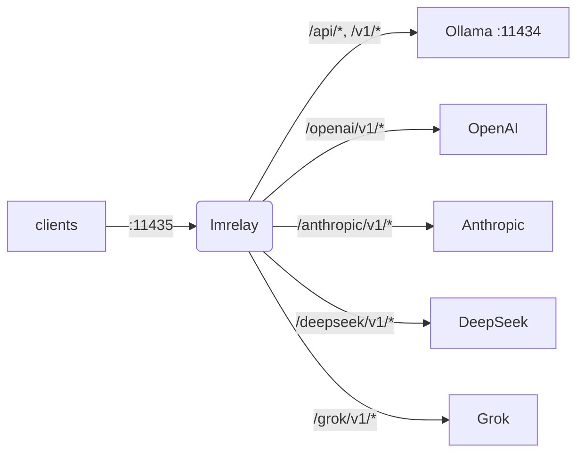

<h1 align="center">lmrelay</h1>

<p align="center">
  A small HTTP relay that listens on <b>11435</b> beside a local
  <a href="https://ollama.com">Ollama</a>, can require a credential from its callers,<br>
  and reaches a hosted provider by prefixing one path segment.
</p>

<p align="center">
  <a href="https://github.com/wachawo/lmrelay"></a>
  
  
  <a href="LICENSE"></a>
</p>

<p align="center">
  <a href="#install">Install</a> ·
  <a href="#configure">Configure</a> ·
  <a href="#commands">Commands</a> ·
  <a href="#choosing-an-upstream">Upstreams</a> ·
  <a href="#behaviour-worth-knowing">Behaviour</a> ·
  <a href="#not-in-scope">Not in scope</a>
</p>



Ollama keeps 11434 and its installation is left exactly as it is. Clients are repointed at
11435 instead. That is the trade: nothing about an existing Ollama has to change, and the
relay is opt-in per client. There is one hand-written config file, one machine-written
state file, and no database.

## lmrelay is a credentialed passthrough, not a translator

lmrelay forwards the method, path, query string and body bytes **unchanged**. It does not
translate between API dialects. Everything below follows from that one sentence, so read
the table before you install anything.

| Your client speaks | Path it uses | ollama | openai | deepseek | grok | anthropic |
|---|---|:--:|:--:|:--:|:--:|:--:|
| Ollama API | `/api/chat`, `/api/generate`, `/api/tags` | yes | no | no | no | no |
| OpenAI API | `/v1/chat/completions`, `/v1/models` | yes¹ | yes | yes | yes | no |
| Anthropic API | `/v1/messages` | no | no | no | no | yes |

¹ Ollama serves an OpenAI-compatible surface at `/v1/*` alongside its native `/api/*`. This
is the practically important cell: an OpenAI-shaped client reaches **all** of ollama,
openai, deepseek and grok by changing only the path prefix.

<details>
<summary><b>What does not work, and why</b></summary>

- **An Ollama-API client cannot reach a hosted provider.** None of them serve `/api/chat`,
  and the body schema differs (`options` versus top-level sampling parameters, `format`
  versus `response_format`, a different streaming frame shape).
- **An OpenAI-shaped client cannot reach Anthropic.** `api.anthropic.com` has no
  `/v1/chat/completions`, and even against `/v1/messages` the body is wrong: Anthropic
  takes `system` as a top-level parameter, requires `max_tokens`, and answers with content
  blocks rather than `choices`.
- **Model names are not translated or validated.** `llama3` means nothing to OpenAI. Name a
  model the upstream you chose actually has.
- **Streaming frames are not converted.** Ollama emits newline-delimited JSON; OpenAI and
  Anthropic emit SSE with different event shapes. Your client gets exactly what the
  upstream produced.

</details>

Where lmrelay can tell that a path certainly does not exist upstream, it says so itself
rather than letting the provider's 404 look like your mistake:

```json
{"error": "lmrelay: upstream 'anthropic' speaks the Anthropic API; '/v1/chat/completions' is an OpenAI-dialect path. lmrelay forwards requests unchanged and does not translate between dialects."}
```

Every error lmrelay generates begins with `lmrelay: `, so it is never mistaken for something
the provider said.

## Install

```bash
pip install git+https://github.com/wachawo/lmrelay.git
```

The `git+` prefix is not decoration: pip reads a bare `github.com/...` as a package name and
fails. Where git is not installed, the [source archive](https://github.com/wachawo/lmrelay/archive/refs/heads/main.tar.gz)
works and needs none:

```bash
pip install https://github.com/wachawo/lmrelay/archive/refs/heads/main.tar.gz
```

Python 3.11 or newer. Three dependencies: FastAPI, uvicorn and httpx.

## Configure

```bash
lmrelay init       # writes ~/.lmrelay/lmrelay.toml, mode 0600
```

The config is looked for in three places, first hit wins, no merging:
`$LMRELAY_CONFIG` (also what any command's `--config PATH` sets), then `./lmrelay.toml`,
then `~/.lmrelay/lmrelay.toml`. If none exists the relay refuses to start rather than
serving 404s from an empty configuration.

Four files live in that config's directory:

| File | Written by | Holds |
|---|---|---|
| [`lmrelay.toml`](lmrelay/lmrelay.toml.example) | you | server settings and hand-written upstreams |
| `state.json` | the CLI | caller tokens, the auth switch, CLI-added providers |
| `lmrelay.pid` | the relay | the pid of the running process |
| `lmrelay.log` | the relay | stdout and stderr of a detached relay |

The split exists so that the CLI never has to rewrite a file you are editing: your comments
in `lmrelay.toml` survive forever. State is JSON rather than a second TOML file because it
is machine-owned, and because `tomllib` reads but cannot write.

<details>
<summary><b>The config file</b></summary>

```toml
[server]
host             = "127.0.0.1"   # 0.0.0.0 only with auth on
port             = 11435         # beside Ollama, which keeps 11434
default_upstream = "ollama"      # used when the path has no upstream prefix
connect_timeout  = 10            # seconds to reach the upstream
log_level        = "INFO"

# Local Ollama, exactly where it already listens. Needs no credential, so it
# has no headers at all.
[upstream.ollama]
base_url = "http://127.0.0.1:11434"
dialect  = "ollama"

# OpenAI. Wants a bearer token.
[upstream.openai]
base_url = "https://api.openai.com"
dialect  = "openai"
headers  = { Authorization = "Bearer ${OPENAI_API_KEY}" }

# Anthropic. Wants x-api-key plus a dated version header, and speaks its own
# dialect on /v1/messages — not /v1/chat/completions.
[upstream.anthropic]
base_url = "https://api.anthropic.com"
dialect  = "anthropic"
headers  = { "x-api-key" = "${ANTHROPIC_API_KEY}", "anthropic-version" = "2023-06-01" }

# DeepSeek and Grok are OpenAI-compatible on the wire.
[upstream.deepseek]
base_url = "https://api.deepseek.com"
dialect  = "openai"
headers  = { Authorization = "Bearer ${DEEPSEEK_API_KEY}" }

[upstream.grok]
base_url = "https://api.x.ai"
dialect  = "openai"
headers  = { Authorization = "Bearer ${XAI_API_KEY}" }
```

The complete commented file ships as
[`lmrelay/lmrelay.toml.example`](lmrelay/lmrelay.toml.example) and is what `lmrelay init`
copies. There the hosted blocks are commented out, so a fresh config starts with Ollama
alone. Uncomment one once its variable is exported; an unset `${VAR}` is a startup error.

</details>

<details>
<summary><b>Notes on the schema</b></summary>

- `headers` is an arbitrary string-to-string table, sent onward verbatim. There is no
  `api_key` field and no per-provider code path: OpenAI's bearer, Anthropic's two headers
  and Ollama's nothing are all the same mechanism, so adding a provider is four lines of
  TOML.
- `${VAR}` in any header **value** is expanded from the process environment, so keys can
  stay out of the file under Docker or systemd. An unset variable is a startup error that
  names the variable.
- `base_url` is prepended verbatim to the forwarded path, so it is normally a host root and
  never ends in `/v1` — the caller's path already carries that. A path prefix is allowed
  and simply concatenated, which is what makes an endpoint hosted under a subpath work
  without any code.
- `dialect` (`ollama`, `openai` or `anthropic`, default `openai`) never changes what is
  sent. Its only job is the refusal shown above.
- TOML forbids `-` in bare keys, so `"x-api-key"` and `"anthropic-version"` are quoted
  while `Authorization` is not. That is not a typo.
- An upstream may not be named `api` or `v1`; either would shadow the path root every
  Ollama and OpenAI client already sends to, and the breakage would be hard to diagnose.
- There is no auth switch in this file. A `[auth] token`, and `$LMRELAY_TOKEN`, are each
  accepted as one *additional* valid caller credential, so a container can inject one
  without invalidating yours; neither turns checking on. Caller tokens are otherwise
  `lmrelay token …` and the switch is `lmrelay auth true|false`.
- A provider added with `lmrelay provider add` wins over an `[upstream.<name>]` of the same
  name. The startup log names any upstream that was overridden — this file is hand-written
  and its author deserves to hear that a command shadowed it.

</details>

## Commands

| Command | Does |
|---|---|
| `lmrelay init` | write `~/.lmrelay/lmrelay.toml` |
| `lmrelay run` | run in the foreground |
| `lmrelay serve` | run detached, appending to `lmrelay.log` |
| `lmrelay stop` | stop the running relay |
| `lmrelay restart` | stop it, then start it detached again |
| `lmrelay reload` | re-read the config without dropping a connection |
| `lmrelay status` | what is running, where, with which upstreams |
| `lmrelay enable` | start at login, and start now |
| `lmrelay disable` | undo `enable` |
| `lmrelay auth true\|false` | require a caller credential, or do not |
| `lmrelay token gen [--label L]` | mint a token and print it once |
| `lmrelay token add TOKEN [--label L]` | register a token you chose yourself |
| `lmrelay token list [--show]` | list tokens, masked unless `--show` |
| `lmrelay token delete ID` | remove one by the id `token list` prints |
| `lmrelay provider add NAME TOKEN` | add or rotate an upstream |
| `lmrelay provider list [--show]` | every upstream, from the file and from state |
| `lmrelay provider delete NAME` | remove a provider that state owns |

`run`, `serve` and `restart` take `--host` and `--port`. `provider add` takes `--base-url`,
`--dialect` and a repeatable `--header K=V`; with a known name — `openai`, `anthropic`,
`deepseek`, `grok`, `ollama` — the base URL, dialect and header shape come from a preset,
so `lmrelay provider add openai sk-...` is the whole command. `--config PATH` is accepted by
every command that reads the config or the state — that is, every command except `init`,
which always writes `~/.lmrelay/lmrelay.toml`.

### First run

```bash
lmrelay init
lmrelay run
```

Auth is off in a fresh state, so on loopback this is a transparent proxy in front of Ollama.
That is deliberate: a relay you have just installed should not lock you out of your own
Ollama before you have a token. Point a client at 11435 and it works:

```bash
OLLAMA_HOST=127.0.0.1:11435 ollama list
```

### Going persistent

```bash
lmrelay token gen --label laptop
lmrelay enable
lmrelay status
```

```
lmrelay      running (pid 40213), healthy
listening    127.0.0.1:11435
config       /home/u/.lmrelay/lmrelay.toml
state        /home/u/.lmrelay/state.json
upstreams    anthropic, ollama, openai (default: ollama)
auth         on, 2 tokens
autostart    systemd: enabled, active
```

`token gen` prints the token in full once and never again, and it turns auth on when it is
the first token — an operator who adds a credential and finds the relay still open has been
surprised for no reason. Afterwards `lmrelay auth false` reopens it and `lmrelay auth true`
closes it again; `auth true` with no tokens is refused, because it would 401 every request
including yours.

`enable` registers a systemd `--user` unit on Linux or a launchd agent on macOS, then starts
it. From then on `stop`, `restart` and `reload` go through that manager instead of the
pidfile, so the two cannot disagree about who owns the process; each command says which path
it took. On a POSIX box with neither manager, `lmrelay serve` runs the relay detached. On
Windows only `lmrelay run` works, and `serve` and `enable` say so rather than half-starting.

A stopped relay prints the same block with `stopped` on the first line, because "what would
it do if I started it" is the question a stopped relay raises. Either way the exit code is
0: `status` reports, it does not assert.

## Choosing an upstream

The first path segment selects the upstream if and only if it exactly matches a key in
`[upstream]`. Otherwise `default_upstream` handles the request and the path is untouched.

```
POST /api/chat                      -> ollama    , forwards /api/chat
POST /v1/chat/completions           -> ollama    , forwards /v1/chat/completions
POST /openai/v1/chat/completions    -> openai    , forwards /v1/chat/completions
POST /anthropic/v1/messages         -> anthropic , forwards /v1/messages
POST /deepseek/v1/chat/completions  -> deepseek  , forwards /v1/chat/completions
POST /grok/v1/chat/completions      -> grok      , forwards /v1/chat/completions
```

So a client only has to learn the port once, and retargeting one at a different provider is
a single line:

```python
from openai import OpenAI
from anthropic import Anthropic

OpenAI(base_url="http://relay:11435/openai/v1", api_key=RELAY_TOKEN)
OpenAI(base_url="http://relay:11435/v1",        api_key=RELAY_TOKEN)   # local Ollama
Anthropic(base_url="http://relay:11435/anthropic", api_key=RELAY_TOKEN)
```

```bash
curl http://127.0.0.1:11435/api/chat \
  -H "Authorization: Bearer $LMRELAY_TOKEN" \
  -d '{"model": "llama3", "messages": [{"role": "user", "content": "hi"}]}'
```

`GET /healthz` answers `{"status": "ok"}` without touching an upstream and without a
credential. Everything else goes through the relay.

## Behaviour worth knowing

- **Nothing is buffered.** Request and response bodies stream in both directions; the
  response is never decoded or inspected, so a token-by-token stream stays token-by-token
  and prompts can never leak into the log.
- **There is no read timeout, on purpose.** A large local model can think for minutes
  before its first token, and a read timeout would kill it in a way that looks like a model
  fault. `connect_timeout` stays short because failing fast on an unreachable host is the
  useful half. Please do not "fix" this.
- **The caller's credential never leaves the relay.** `Authorization` and `x-api-key` are
  stripped from every forwarded request before the upstream's own headers are applied, so
  an upstream with no configured headers receives no credential at all.

<details>
<summary><b>Six more, on reloads, pidfiles and failure</b></summary>

- **The elapsed time in the access log is time to first byte**, not the duration of a
  streamed answer.
- **A reload applies upstreams, tokens and the auth switch — not `host`, `port` or
  `connect_timeout`.** A running server cannot rebind its socket or re-time a client that is
  already open. The reload log names the ones that changed and says a restart applies them.
- **A config that fails to parse on reload is logged and discarded**, and the relay keeps
  serving the one it already had. A typo must not take the relay down. That covers
  `state.json` as well as `lmrelay.toml`, and it is why `token gen`, `auth true` and the rest
  say they signalled the relay rather than that the change is live: the reload is delivered,
  not acknowledged, and its outcome is in the relay's log.
- **The pidfile is written by the relay itself**, whether it was started by `run`, by
  `serve` or by a service manager, so `status`, `stop` and `reload` have one place to look
  regardless. A pidfile naming a dead process is overwritten silently; one naming a live
  process makes a second start refuse, rather than letting it fail later on the bind with a
  less useful message.
- **An unreachable upstream is a 502 that names it**, e.g.
  `lmrelay: upstream 'ollama' at http://127.0.0.1:11434 is unreachable: ConnectError` —
  usually meaning Ollama itself is not running.
- **Binding a non-loopback host with auth off logs a warning** rather than refusing, since
  running uncredentialed behind an authenticated nginx is legitimate.

</details>

## Not in scope

No failover, retry or load balancing. No dialect translation. No model catalogue or
aliasing. No token accounting, usage database or budgets. No admin API, dashboard or
metrics. No caching or rate limiting. No TLS — put nginx in front.

## Tests

```sh
pip install -e '.[test]'
pytest
```

Most of the suite drives the app in process against a recording upstream, so it needs no
network and no Ollama. [`tests/test_streaming.py`](tests/test_streaming.py) is the
exception: it runs the relay under uvicorn in front of an upstream that answers a chunk at a
time, because the property it checks — that the caller has the first line before the
upstream has written the last — cannot be seen through an in-process client.

## License

MIT. See [LICENSE](LICENSE).

<p align="center">
  <sub>
    <a href="https://github.com/wachawo/lmrelay">Repository</a> ·
    <a href="https://github.com/wachawo/lmrelay/issues">Issues</a>
  </sub>
</p>
