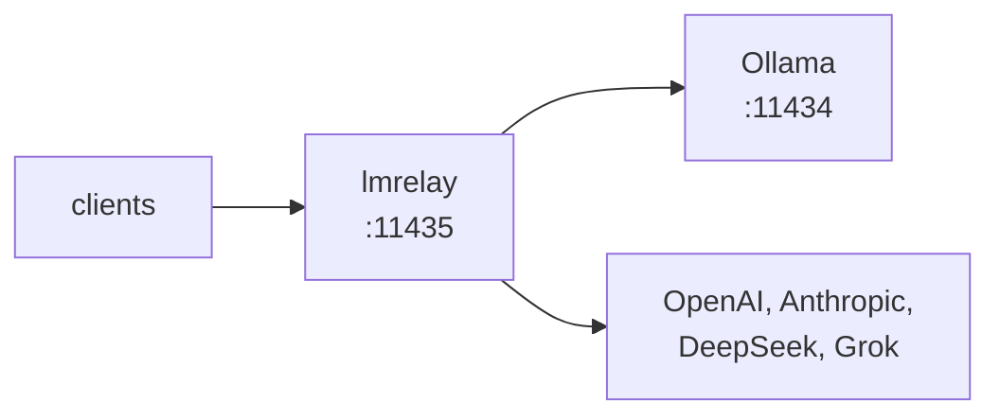

## lmrelay - ein zugangsgeschütztes Relay neben einem lokalen Ollama

[](https://github.com/wachawo/lmrelay/blob/main/LICENSE)
[](https://github.com/wachawo/lmrelay)
[](https://github.com/wachawo/lmrelay)
[](https://github.com/wachawo/lmrelay/blob/main/pyproject.toml)

Ein kleines HTTP-Relay, das neben einem lokalen [Ollama](https://ollama.com) auf 11435 lauscht, von seinen Aufrufern Zugangsdaten verlangen kann und gehostete Anbieter über ein vorangestelltes Pfadsegment erreicht.

[English](https://github.com/wachawo/lmrelay/blob/main/README.md) | [Español](https://github.com/wachawo/lmrelay/blob/main/docs/README_ES.md) | [Português](https://github.com/wachawo/lmrelay/blob/main/docs/README_PT.md) | [Français](https://github.com/wachawo/lmrelay/blob/main/docs/README_FR.md) | **[Deutsch](https://github.com/wachawo/lmrelay/blob/main/docs/README_DE.md)** | [Italiano](https://github.com/wachawo/lmrelay/blob/main/docs/README_IT.md) | [Русский](https://github.com/wachawo/lmrelay/blob/main/docs/README_RU.md) | [中文](https://github.com/wachawo/lmrelay/blob/main/docs/README_ZH.md) | [日本語](https://github.com/wachawo/lmrelay/blob/main/docs/README_JA.md) | [हिन्दी](https://github.com/wachawo/lmrelay/blob/main/docs/README_HI.md) | [한국어](https://github.com/wachawo/lmrelay/blob/main/docs/README_KR.md)



### Voraussetzungen

- Python 3.11 oder höher und drei Abhängigkeiten: FastAPI, uvicorn und httpx.
- Linux und macOS führen jeden Befehl aus, auch `serve` (im Hintergrund) und `enable`: eine
  systemd-`--user`-Unit unter Linux, ein launchd-Agent unter macOS, und eine Absage dort, wo
  keiner von beiden installiert ist.
- Windows führt nur `run` aus. `serve` meldet, dass die Plattform kein `os.fork` hat, und
  `enable`, dass es weder systemd noch launchd gibt, statt halb zu starten.
- Ein lokales Ollama auf 11434 ist der Standard-Upstream, aber nicht erforderlich. Ein Relay,
  das nur gehostete Anbieter konfiguriert hat, ist gültig, solange `default_upstream` einen
  davon benennt.

### Installation

```bash
pip install git+https://github.com/wachawo/lmrelay.git
```

Das Präfix `git+` ist keine Zierde: pip liest ein blankes `github.com/...` als Paketnamen und
schlägt fehl. Wo git nicht installiert ist, funktioniert das Quellarchiv und braucht keines:

```bash
pip install https://github.com/wachawo/lmrelay/archive/refs/heads/main.tar.gz
```

### Schnellstart

```bash
lmrelay init     # writes ~/.lmrelay/lmrelay.toml
lmrelay run      # foreground, port 11435
```

Ollama behält 11434, und an seiner Installation bleibt alles genau so, wie es ist.
Stattdessen werden die Clients auf 11435 umgestellt. Das ist der Kompromiss: An einem
bestehenden Ollama muss sich nichts ändern, und das Relay ist pro Client zuschaltbar.

Im frischen State ist die Authentifizierung aus, auf Loopback ist das also ein transparenter
Proxy vor Ollama. Das ist Absicht: Ein gerade installiertes Relay soll den Weg zum eigenen
Ollama nicht versperren, solange noch kein Token existiert. Ein auf 11435 gerichteter Client
funktioniert sofort:

```bash
OLLAMA_HOST=127.0.0.1:11435 ollama list
```

### Prüfen, ob es funktioniert

Frage den Relay nach der Modellliste. Beide Dialekte gehen; beide erreichen dasselbe Ollama:

```bash
curl http://127.0.0.1:11435/api/tags    # Ollama's shape
curl http://127.0.0.1:11435/v1/models   # OpenAI's shape
```

Dann lass ein Modell arbeiten. `qwen3:8b` steht hier für das, was `ollama list` auf der eigenen Maschine anzeigt:

```bash
curl http://127.0.0.1:11435/api/generate -d '{
  "model": "qwen3:8b",
  "prompt": "Reply with exactly: it works",
  "stream": false,
  "think": false
}'
```

```bash
curl http://127.0.0.1:11435/v1/chat/completions \
  -H "Content-Type: application/json" \
  -d '{
  "model": "qwen3:8b",
  "messages": [{"role": "user", "content": "say ok"}]
}'
```

`qwen3` denkt nach, bevor es antwortet, und nur Ollamas Dialekt hat dafür einen Schalter: das `"think": false` oben. Über `/v1/chat/completions` kommt die Argumentation als `<think>`-Block im Inhalt an, denn lmrelay leitet weiter, was der Upstream erzeugt hat, und bearbeitet es nicht.

Bei eingeschalteter Authentifizierung braucht jede dieser Anfragen die Zugangsdaten:

```bash
curl http://127.0.0.1:11435/api/tags \
  -H "Authorization: Bearer $LMRELAY_TOKEN"
```

### Produktiver Betrieb

```bash
lmrelay token gen --label laptop   # printed once; turns auth on
lmrelay enable                     # start at login, and start now
lmrelay status
```

```
lmrelay      running (pid 40213), healthy
listening    127.0.0.1:11435
config       /home/u/.lmrelay/lmrelay.toml
state        /home/u/.lmrelay/state.json
upstreams    anthropic, ollama, openai (default: ollama)
auth         on, 2 tokens
autostart    systemd: enabled, active
```

`enable` registriert unter Linux eine systemd-`--user`-Unit oder unter macOS einen
launchd-Agent und startet sie anschließend. Von da an laufen `stop`, `restart` und `reload`
über diesen Manager statt über die PID-Datei, sodass die beiden nicht uneins darüber werden
können, wem der Prozess gehört. Auf einem POSIX-System ohne beide Manager startet
`lmrelay serve` das Relay im Hintergrund.

### Verwendung

| Befehl | Wirkung |
|---|---|
| `lmrelay init` | `~/.lmrelay/lmrelay.toml` schreiben |
| `lmrelay run` | im Vordergrund laufen |
| `lmrelay serve` | im Hintergrund laufen, hängt an `lmrelay.log` an |
| `lmrelay stop` | das laufende Relay stoppen |
| `lmrelay restart` | stoppen, dann wieder im Hintergrund starten |
| `lmrelay reload` | Konfiguration neu einlesen, ohne eine Verbindung zu verlieren |
| `lmrelay status` | was läuft, wo und mit welchen Upstreams |
| `lmrelay enable` | beim Login starten und jetzt starten |
| `lmrelay disable` | `enable` rückgängig machen |
| `lmrelay auth true\|false` | Zugangsdaten vom Aufrufer verlangen oder nicht |
| `lmrelay token gen [--label L]` | ein Token erzeugen und einmalig ausgeben |
| `lmrelay token add TOKEN [--label L]` | ein selbst gewähltes Token registrieren |
| `lmrelay token list [--show]` | Tokens auflisten, maskiert außer mit `--show` |
| `lmrelay token delete ID` | eines über die von `token list` ausgegebene ID entfernen |
| `lmrelay provider add NAME TOKEN` | einen Upstream hinzufügen oder rotieren |
| `lmrelay provider list [--show]` | alle Upstreams, aus der Datei und aus dem State |
| `lmrelay provider delete NAME` | einen Anbieter entfernen, der dem State gehört |

`run`, `serve` und `restart` nehmen `--host` und `--port`. `provider add` nimmt `--base-url`,
`--dialect` und ein wiederholbares `--header K=V`; bei einem bekannten Namen — `openai`,
`anthropic`, `deepseek`, `grok`, `ollama` — stammen Basis-URL, Dialekt und Header-Form aus
einem Preset, sodass `lmrelay provider add openai sk-...` der ganze Befehl ist.
`--config PATH` nimmt jeder Befehl an, der die Konfiguration oder den State liest — also
jeder Befehl außer `init`, das immer `~/.lmrelay/lmrelay.toml` schreibt, und `disable`, das
weder das eine noch das andere liest.

### Auswahl des Upstreams

Das erste Pfadsegment wählt den Upstream genau dann, wenn es exakt einem Schlüssel in
`[upstream]` entspricht. Andernfalls bearbeitet `default_upstream` die Anfrage, und der Pfad
bleibt unangetastet.

```
POST /api/chat                     -> ollama     /api/chat
POST /v1/chat/completions          -> ollama     /v1/chat/completions
POST /openai/v1/chat/completions   -> openai     /v1/chat/completions
POST /anthropic/v1/messages        -> anthropic  /v1/messages
POST /deepseek/v1/chat/completions -> deepseek   /v1/chat/completions
POST /grok/v1/chat/completions     -> grok       /v1/chat/completions
```

Ein Client muss den Port also nur einmal lernen, und ihn auf einen anderen Anbieter
umzuhängen ist eine einzige Zeile:

```python
from openai import OpenAI
from anthropic import Anthropic

OpenAI(base_url="http://relay:11435/openai/v1", api_key=RELAY_TOKEN)
OpenAI(base_url="http://relay:11435/v1", api_key=RELAY_TOKEN)  # Ollama
Anthropic(base_url="http://relay:11435/anthropic", api_key=RELAY_TOKEN)
```

```bash
curl http://127.0.0.1:11435/api/chat \
  -H "Authorization: Bearer $LMRELAY_TOKEN" \
  -d '{
  "model": "llama3",
  "messages": [{"role": "user", "content": "hi"}]
}'
```

`GET /healthz` antwortet mit `{"status": "ok"}`, ohne einen Upstream anzufassen und ohne
Zugangsdaten. Alles andere geht durch das Relay.

### Kompatibilität

lmrelay leitet Methode, Pfad, Query-String und Body-Bytes **unverändert** weiter und
übersetzt nicht zwischen API-Dialekten.

| Der Client spricht | Verwendeter Pfad | ollama | openai | deepseek | grok | anthropic |
|---|---|:--:|:--:|:--:|:--:|:--:|
| Ollama API | `/api/chat`, `/api/generate`, `/api/tags` | yes | no | no | no | no |
| OpenAI API | `/v1/chat/completions`, `/v1/models` | yes¹ | yes | yes | yes | no |
| Anthropic API | `/v1/messages` | no | no | no | no | yes |

¹ Ollama stellt neben seinem nativen `/api/*` eine OpenAI-kompatible Oberfläche unter `/v1/*`
bereit. Das ist die praktisch wichtige Zelle: Ein Client im OpenAI-Format erreicht **alle**
— ollama, openai, deepseek und grok — allein über ein anderes Pfadpräfix.

Die vier Fälle, die nicht funktionieren, und der Grund, warum sich keiner davon zum
Funktionieren bringen lässt, stehen im Konfigurationsdokument.

Wo lmrelay erkennen kann, dass ein Pfad im Upstream sicher nicht existiert, sagt es das
selbst, statt den 404 des Anbieters wie einen Fehler des Aufrufers aussehen zu lassen:

```text
lmrelay: upstream 'anthropic' speaks the Anthropic API;
'/v1/chat/completions' is an OpenAI-dialect path. lmrelay
forwards requests unchanged and does not translate between
dialects.
```

Jeder Fehler, den lmrelay erzeugt, beginnt mit `lmrelay: `, damit er nie für eine Aussage des
Anbieters gehalten wird.

**[Konfiguration und Fehler](https://github.com/wachawo/lmrelay/blob/main/docs/CONFIGURATION.md)** - die Konfigurationsdatei, Aufrufer-Tokens, Anbieter, Autostart, Streaming-Verhalten und was jeder Fehler bedeutet.

### Tests

```sh
pip install -e '.[test]'
pytest
```

Der größte Teil der Suite treibt die Anwendung im selben Prozess gegen einen aufzeichnenden
Upstream und braucht daher weder Netzwerk noch Ollama.
[`tests/test_streaming.py`](../tests/test_streaming.py) ist die Ausnahme: Dort läuft das Relay
unter uvicorn vor einem Upstream, der Chunk für Chunk antwortet, denn die geprüfte
Eigenschaft — dass der Aufrufer die erste Zeile hat, bevor der Upstream die letzte
geschrieben hat — ist durch einen In-Process-Client nicht zu sehen.

### Lizenz

MIT License. Siehe [LICENSE](../LICENSE).
