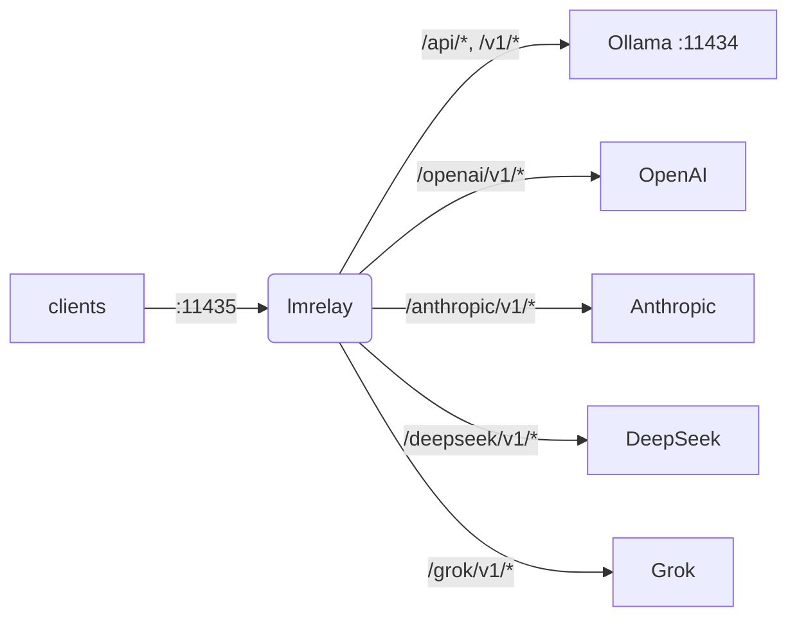

## lmrelay - un relay con credenciales junto a un Ollama local

[](https://github.com/wachawo/lmrelay/blob/main/LICENSE)
[](https://github.com/wachawo/lmrelay)
[](https://github.com/wachawo/lmrelay)
[](https://github.com/wachawo/lmrelay/blob/main/pyproject.toml)

Un pequeño relay HTTP que escucha en 11435 junto a un [Ollama](https://ollama.com) local, puede exigir una credencial a quien lo llama y llega a un proveedor alojado anteponiendo un segmento de ruta.

[English](https://github.com/wachawo/lmrelay/blob/main/README.md) | **[Español](https://github.com/wachawo/lmrelay/blob/main/docs/README_ES.md)** | [Português](https://github.com/wachawo/lmrelay/blob/main/docs/README_PT.md) | [Français](https://github.com/wachawo/lmrelay/blob/main/docs/README_FR.md) | [Deutsch](https://github.com/wachawo/lmrelay/blob/main/docs/README_DE.md) | [Italiano](https://github.com/wachawo/lmrelay/blob/main/docs/README_IT.md) | [Русский](https://github.com/wachawo/lmrelay/blob/main/docs/README_RU.md) | [中文](https://github.com/wachawo/lmrelay/blob/main/docs/README_ZH.md) | [日本語](https://github.com/wachawo/lmrelay/blob/main/docs/README_JA.md) | [हिन्दी](https://github.com/wachawo/lmrelay/blob/main/docs/README_HI.md) | [한국어](https://github.com/wachawo/lmrelay/blob/main/docs/README_KR.md)



### Requisitos

- Python 3.11 o superior, y tres dependencias: FastAPI, uvicorn y httpx.
- Linux y macOS ejecutan todos los comandos, incluidos `serve` (en segundo plano) y `enable`:
  una unidad systemd `--user` en Linux, un agente launchd en macOS, y un rechazo allí donde no
  hay ninguno de los dos instalado.
- Windows solo ejecuta `run`. `serve` informa de que la plataforma no tiene `os.fork`, y
  `enable` de que no hay systemd ni launchd, en lugar de arrancar a medias.
- Un Ollama local en 11434 es el upstream por defecto, pero no es obligatorio. Un relay
  configurado solo con proveedores alojados es válido, siempre que `default_upstream` nombre
  uno de ellos.

### Instalación

```bash
pip install git+https://github.com/wachawo/lmrelay.git
```

El prefijo `git+` no es decorativo: pip interpreta un `github.com/...` a secas como nombre de
paquete y falla. Donde git no está instalado, el archivo de fuentes funciona y no lo necesita:

```bash
pip install https://github.com/wachawo/lmrelay/archive/refs/heads/main.tar.gz
```

### Inicio rápido

```bash
lmrelay init     # writes ~/.lmrelay/lmrelay.toml
lmrelay run      # foreground, port 11435
```

Ollama conserva el 11434 y su instalación queda exactamente igual. En su lugar, se reapuntan
los clientes al 11435. Ese es el trato: nada de un Ollama existente tiene que cambiar, y el
relay se adopta cliente a cliente.

La autenticación está desactivada en un estado recién creado, así que en loopback esto es un
proxy transparente delante de Ollama. Es deliberado: un relay que acabas de instalar no debe
dejarte fuera de tu propio Ollama antes de que tengas un token. Apunta un cliente al 11435 y
funciona:

```bash
OLLAMA_HOST=127.0.0.1:11435 ollama list
```

### Puesta en marcha real

```bash
lmrelay token gen --label laptop   # prints the token once, turns auth on
lmrelay enable                     # start at login, and start now
lmrelay status
```

```
lmrelay      running (pid 40213), healthy
listening    127.0.0.1:11435
config       /home/u/.lmrelay/lmrelay.toml
state        /home/u/.lmrelay/state.json
upstreams    anthropic, ollama, openai (default: ollama)
auth         on, 2 tokens
autostart    systemd: enabled, active
```

`enable` registra una unidad systemd `--user` en Linux o un agente launchd en macOS, y luego
lo arranca. A partir de ahí, `stop`, `restart` y `reload` pasan por ese gestor en vez de por
el pidfile, de modo que los dos no pueden discrepar sobre quién es el dueño del proceso. En
una máquina POSIX sin ninguno de los dos gestores, `lmrelay serve` ejecuta el relay en
segundo plano.

### Uso

| Comando | Qué hace |
|---|---|
| `lmrelay init` | escribe `~/.lmrelay/lmrelay.toml` |
| `lmrelay run` | ejecuta en primer plano |
| `lmrelay serve` | ejecuta en segundo plano, añadiendo a `lmrelay.log` |
| `lmrelay stop` | detiene el relay en ejecución |
| `lmrelay restart` | lo detiene y lo vuelve a arrancar en segundo plano |
| `lmrelay reload` | relee la configuración sin cortar ninguna conexión |
| `lmrelay status` | qué se está ejecutando, dónde y con qué upstreams |
| `lmrelay enable` | arranca al iniciar sesión, y arranca ahora |
| `lmrelay disable` | deshace `enable` |
| `lmrelay auth true\|false` | exigir una credencial a quien llama, o no |
| `lmrelay token gen [--label L]` | acuña un token y lo imprime una sola vez |
| `lmrelay token add TOKEN [--label L]` | registra un token elegido por ti |
| `lmrelay token list [--show]` | lista los tokens, enmascarados salvo con `--show` |
| `lmrelay token delete ID` | elimina uno por el id que imprime `token list` |
| `lmrelay provider add NAME TOKEN` | añade o rota un upstream |
| `lmrelay provider list [--show]` | todos los upstreams, los del archivo y los del estado |
| `lmrelay provider delete NAME` | elimina un proveedor que pertenece al estado |

`run`, `serve` y `restart` aceptan `--host` y `--port`. `provider add` acepta `--base-url`,
`--dialect` y un `--header K=V` repetible; con un nombre conocido —`openai`, `anthropic`,
`deepseek`, `grok`, `ollama`— la URL base, el dialecto y la forma de las cabeceras salen de un
preajuste, así que `lmrelay provider add openai sk-...` es el comando entero. `--config PATH`
lo acepta todo comando que lee la configuración o el estado, es decir, todos menos `init`, que
siempre escribe `~/.lmrelay/lmrelay.toml`, y `disable`, que no lee ninguno de los dos.

### Elegir un upstream

El primer segmento de la ruta selecciona el upstream si y solo si coincide exactamente con una
clave de `[upstream]`. En caso contrario, `default_upstream` atiende la petición y la ruta
queda intacta.

```
POST /api/chat                      -> ollama    , forwards /api/chat
POST /v1/chat/completions           -> ollama    , forwards /v1/chat/completions
POST /openai/v1/chat/completions    -> openai    , forwards /v1/chat/completions
POST /anthropic/v1/messages         -> anthropic , forwards /v1/messages
POST /deepseek/v1/chat/completions  -> deepseek  , forwards /v1/chat/completions
POST /grok/v1/chat/completions      -> grok      , forwards /v1/chat/completions
```

Así, un cliente solo tiene que aprender el puerto una vez, y reapuntarlo a otro proveedor es
una sola línea:

```python
from openai import OpenAI
from anthropic import Anthropic

OpenAI(base_url="http://relay:11435/openai/v1", api_key=RELAY_TOKEN)
OpenAI(base_url="http://relay:11435/v1",        api_key=RELAY_TOKEN)   # local Ollama
Anthropic(base_url="http://relay:11435/anthropic", api_key=RELAY_TOKEN)
```

```bash
curl http://127.0.0.1:11435/api/chat \
  -H "Authorization: Bearer $LMRELAY_TOKEN" \
  -d '{"model": "llama3", "messages": [{"role": "user", "content": "hi"}]}'
```

`GET /healthz` responde `{"status": "ok"}` sin tocar ningún upstream y sin credencial. Todo lo
demás pasa por el relay.

### Compatibilidad

lmrelay reenvía el método, la ruta, la query string y los bytes del cuerpo **sin cambios**, y
no traduce entre dialectos de API.

| Tu cliente habla | Ruta que usa | ollama | openai | deepseek | grok | anthropic |
|---|---|:--:|:--:|:--:|:--:|:--:|
| Ollama API | `/api/chat`, `/api/generate`, `/api/tags` | yes | no | no | no | no |
| OpenAI API | `/v1/chat/completions`, `/v1/models` | yes¹ | yes | yes | yes | no |
| Anthropic API | `/v1/messages` | no | no | no | no | yes |

¹ Ollama expone una superficie compatible con OpenAI en `/v1/*` junto a su `/api/*` nativo.
Esta es la casilla que importa en la práctica: un cliente con forma de OpenAI llega a **todos**
—ollama, openai, deepseek y grok— cambiando solo el prefijo de la ruta.

Los cuatro casos que no funcionan, y la razón por la que ninguno puede hacerse funcionar, están
en el documento de configuración.

Cuando lmrelay puede determinar que una ruta con seguridad no existe en el upstream, lo dice él
mismo en lugar de dejar que el 404 del proveedor parezca un error tuyo:

```json
{"error": "lmrelay: upstream 'anthropic' speaks the Anthropic API; '/v1/chat/completions' is an OpenAI-dialect path. lmrelay forwards requests unchanged and does not translate between dialects."}
```

Todo error que genera lmrelay empieza por `lmrelay: `, así que nunca se confunde con algo dicho
por el proveedor.

**[Configuración y errores](https://github.com/wachawo/lmrelay/blob/main/docs/CONFIGURATION.md)** - el archivo de configuración, los tokens de quien llama, los proveedores, el autoarranque, el comportamiento del streaming y qué significa cada error.

### Pruebas

```sh
pip install -e '.[test]'
pytest
```

La mayor parte de la suite ejecuta la aplicación en el mismo proceso contra un upstream que
graba lo que recibe, así que no necesita red ni Ollama.
[`tests/test_streaming.py`](../tests/test_streaming.py) es la excepción: levanta el relay bajo
uvicorn delante de un upstream que responde un fragmento cada vez, porque la propiedad que
comprueba —que quien llama tiene la primera línea antes de que el upstream haya escrito la
última— no se puede observar a través de un cliente en el mismo proceso.

### Licencia

Licencia MIT. Véase [LICENSE](../LICENSE).
