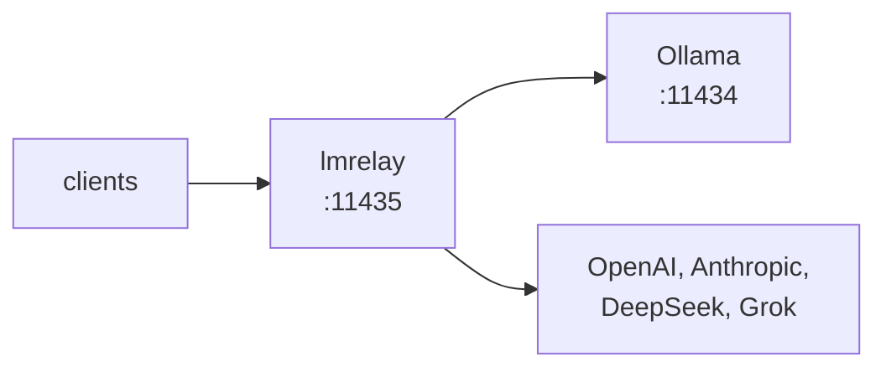

## lmrelay - un relais à identifiants à côté d'un Ollama local

[](https://github.com/wachawo/lmrelay/actions/workflows/ci.yml)
[](https://github.com/wachawo/lmrelay/blob/main/LICENSE)
[](https://github.com/wachawo/lmrelay)
[](https://github.com/wachawo/lmrelay)
[](https://github.com/wachawo/lmrelay/blob/main/pyproject.toml)

Ollama n'embarque aucune authentification : il répond sur la loopback et n'en sort pas.
L'atteindre depuis une autre machine a signifié placer un nginx devant, puis le maintenir.
lmrelay fait ce même travail sous forme de démon installé avec pip : il écoute sur 11435 à
côté d'Ollama, exige des identifiants de ses appelants et — puisqu'il est déjà sur le
chemin — atteint OpenAI, Anthropic, DeepSeek ou Grok en préfixant un segment de chemin.

[English](https://github.com/wachawo/lmrelay/blob/main/README.md) | [Español](https://github.com/wachawo/lmrelay/blob/main/docs/README_ES.md) | [Português](https://github.com/wachawo/lmrelay/blob/main/docs/README_PT.md) | **[Français](https://github.com/wachawo/lmrelay/blob/main/docs/README_FR.md)** | [Deutsch](https://github.com/wachawo/lmrelay/blob/main/docs/README_DE.md) | [Italiano](https://github.com/wachawo/lmrelay/blob/main/docs/README_IT.md) | [Русский](https://github.com/wachawo/lmrelay/blob/main/docs/README_RU.md) | [中文](https://github.com/wachawo/lmrelay/blob/main/docs/README_ZH.md) | [日本語](https://github.com/wachawo/lmrelay/blob/main/docs/README_JA.md) | [हिन्दी](https://github.com/wachawo/lmrelay/blob/main/docs/README_HI.md) | [한국어](https://github.com/wachawo/lmrelay/blob/main/docs/README_KR.md)



### Prérequis

- Python 3.11 ou supérieur, et quatre dépendances : FastAPI, starlette, uvicorn et httpx.
- Linux et macOS exécutent toutes les commandes, y compris `serve` (détaché) et `enable` :
  une unité systemd `--user` sous Linux, un agent launchd sous macOS, et un refus là où aucun
  des deux n'est installé.
- Windows n'exécute que `run`. `serve` signale que la plateforme n'a pas `os.fork`, et
  `enable` qu'il n'y a ni systemd ni launchd, au lieu de démarrer à moitié.
- Un Ollama local sur 11434 est l'upstream par défaut, mais il n'est pas obligatoire. Un relais
  configuré avec des fournisseurs hébergés uniquement est valide, à condition que
  `default_upstream` en nomme un.

### Installation

```bash
pip install git+https://github.com/wachawo/lmrelay.git
```

Le préfixe `git+` n'est pas décoratif : pip lit un `github.com/...` nu comme un nom de paquet
et échoue. Là où git n'est pas installé, l'archive des sources fonctionne et n'en a pas besoin :

```bash
pip install https://github.com/wachawo/lmrelay/archive/refs/heads/main.tar.gz
```

### Démarrage rapide

```bash
lmrelay init     # writes ~/.lmrelay/lmrelay.toml
lmrelay run      # foreground, port 11435
```

Ollama garde 11434 et son installation reste exactement telle quelle. Ce sont les clients qui
sont redirigés vers 11435. Voilà le compromis : rien ne change dans un Ollama existant, et le
relais s'active client par client.

L'authentification est désactivée dans un état neuf ; sur la boucle locale, c'est donc un proxy
transparent devant Ollama. C'est délibéré : un relais que vous venez d'installer ne doit pas
vous couper l'accès à votre propre Ollama avant que vous ayez un token. Pointez un client sur
11435 et cela fonctionne :

```bash
OLLAMA_HOST=127.0.0.1:11435 ollama list
```

### Vérifier que cela fonctionne

Demandez au relais la liste des modèles. L'un ou l'autre dialecte convient ; les deux atteignent le même Ollama :

```bash
curl http://127.0.0.1:11435/api/tags    # Ollama's shape
curl http://127.0.0.1:11435/v1/models   # OpenAI's shape
```

Puis mettez un modèle au travail. Ici `qwen3:8b` correspond à ce qu'affiche `ollama list` sur votre machine :

```bash
curl http://127.0.0.1:11435/api/generate -d '{
  "model": "qwen3:8b",
  "prompt": "Reply with exactly: it works",
  "stream": false,
  "think": false
}'
```

```bash
curl http://127.0.0.1:11435/v1/chat/completions \
  -H "Content-Type: application/json" \
  -d '{
  "model": "qwen3:8b",
  "messages": [{"role": "user", "content": "say ok"}]
}'
```

`qwen3` raisonne avant de répondre, et seul le dialecte d'Ollama dispose d'un interrupteur pour cela : le `"think": false` ci-dessus. Via `/v1/chat/completions`, le raisonnement arrive dans le contenu sous forme de bloc `<think>`, car lmrelay transmet ce que l'amont a produit sans le modifier.

Avec l'authentification activée, chacune de ces requêtes exige les identifiants :

```bash
curl http://127.0.0.1:11435/api/tags \
  -H "Authorization: Bearer $LMRELAY_TOKEN"
```

### En conditions réelles

```bash
lmrelay token gen --label laptop   # printed once, never again
lmrelay auth true                  # now start requiring it
lmrelay enable                     # start at login, and start now
lmrelay status
```

```
lmrelay      running (pid 40213), healthy
listening    127.0.0.1:11435
config       /home/u/.lmrelay/lmrelay.toml
state        /home/u/.lmrelay/state.json
upstreams    anthropic, ollama, openai (default: ollama)
auth         on, 2 tokens
autostart    systemd: enabled, active
```

`enable` enregistre une unité systemd `--user` sous Linux ou un agent launchd sous macOS, puis
la démarre. À partir de là, `stop`, `restart` et `reload` passent par ce gestionnaire plutôt que
par le fichier pid, si bien que les deux ne peuvent pas se contredire sur le propriétaire du
processus. Sur une machine POSIX dépourvue des deux gestionnaires, `lmrelay serve` lance le
relais en mode détaché.

### Utilisation

| Commande | Effet |
|---|---|
| `lmrelay init` | écrire `~/.lmrelay/lmrelay.toml` |
| `lmrelay run` | exécuter au premier plan |
| `lmrelay serve` | exécuter en mode détaché, en ajoutant à `lmrelay.log` |
| `lmrelay stop` | arrêter le relais en cours d'exécution |
| `lmrelay restart` | l'arrêter, puis le relancer en mode détaché |
| `lmrelay reload` | relire la configuration sans couper une connexion |
| `lmrelay status` | ce qui tourne, où, et avec quels upstreams |
| `lmrelay enable` | démarrer à l'ouverture de session, et démarrer maintenant |
| `lmrelay disable` | annuler `enable` |
| `lmrelay auth true\|false` | exiger un identifiant de l'appelant, ou non |
| `lmrelay token gen [--label L]` | générer un token et l'afficher une seule fois |
| `lmrelay token add TOKEN [--label L]` | enregistrer un token que vous avez choisi vous-même |
| `lmrelay token list [--show]` | lister les tokens, masqués sauf avec `--show` |
| `lmrelay token delete ID` | en supprimer un par l'id qu'affiche `token list` |
| `lmrelay provider add NAME TOKEN` | ajouter un upstream ou en changer la clé |
| `lmrelay provider list [--show]` | tous les upstreams, ceux du fichier et ceux de l'état |
| `lmrelay provider delete NAME` | supprimer un fournisseur détenu par l'état |

`run`, `serve` et `restart` acceptent `--host` et `--port`. `provider add` accepte `--base-url`,
`--dialect` et un `--header K=V` répétable ; avec un nom connu — `openai`, `anthropic`,
`deepseek`, `grok`, `ollama` — l'URL de base, le dialecte et la forme des en-têtes viennent d'un
préréglage, si bien que `lmrelay provider add openai sk-...` est la commande entière.
`--config PATH` est accepté par toute commande qui lit la configuration ou l'état — c'est-à-dire
toutes sauf `init`, qui écrit toujours `~/.lmrelay/lmrelay.toml`, et `disable`, qui ne lit ni
l'une ni l'autre.

### Choisir un upstream

Le premier segment du chemin sélectionne l'upstream si et seulement s'il correspond exactement à
une clé de `[upstream]`. Sinon, `default_upstream` traite la requête et le chemin reste intact.

```
POST /api/chat                     -> ollama     /api/chat
POST /v1/chat/completions          -> ollama     /v1/chat/completions
POST /openai/v1/chat/completions   -> openai     /v1/chat/completions
POST /anthropic/v1/messages        -> anthropic  /v1/messages
POST /deepseek/v1/chat/completions -> deepseek   /v1/chat/completions
POST /grok/v1/chat/completions     -> grok       /v1/chat/completions
```

Un client n'a donc à apprendre le port qu'une seule fois, et le rediriger vers un autre
fournisseur tient en une ligne :

```python
from openai import OpenAI
from anthropic import Anthropic

OpenAI(base_url="http://relay:11435/openai/v1", api_key=RELAY_TOKEN)
OpenAI(base_url="http://relay:11435/v1", api_key=RELAY_TOKEN)  # Ollama
Anthropic(base_url="http://relay:11435/anthropic", api_key=RELAY_TOKEN)
```

```bash
curl http://127.0.0.1:11435/api/chat \
  -H "Authorization: Bearer $LMRELAY_TOKEN" \
  -d '{
  "model": "llama3",
  "messages": [{"role": "user", "content": "hi"}]
}'
```

`GET /healthz` répond `{"status": "ok"}` sans toucher à un upstream et sans identifiant. Tout le
reste passe par le relais.

### Compatibilité

lmrelay transmet la méthode, le chemin, la chaîne de requête et les octets du corps **sans
modification**, et ne traduit pas d'un dialecte d'API vers un autre.

| Votre client parle | Chemin utilisé | ollama | openai | deepseek | grok | anthropic |
|---|---|:--:|:--:|:--:|:--:|:--:|
| API Ollama | `/api/chat`, `/api/generate`, `/api/tags` | yes | no | no | no | no |
| API OpenAI | `/v1/chat/completions`, `/v1/models` | yes¹ | yes | yes | yes | no |
| API Anthropic | `/v1/messages` | no | no | no | no | yes |

¹ Ollama expose une surface compatible OpenAI sur `/v1/*` à côté de son `/api/*` natif. C'est la
case qui compte en pratique : un client de forme OpenAI atteint **tous** les upstreams ollama,
openai, deepseek et grok en ne changeant que le préfixe du chemin.

Les quatre cas qui ne fonctionnent pas, et la raison pour laquelle aucun ne peut être rendu
fonctionnel, figurent dans le document de configuration.

Lorsque lmrelay peut déterminer qu'un chemin n'existe certainement pas en amont, il le dit
lui-même plutôt que de laisser le 404 du fournisseur passer pour votre erreur :

```text
lmrelay: upstream 'anthropic' speaks the Anthropic API;
'/v1/chat/completions' is an OpenAI-dialect path. lmrelay
forwards requests unchanged and does not translate between
dialects.
```

Toute erreur produite par lmrelay commence par `lmrelay: `, elle n'est donc jamais confondue avec
un message du fournisseur.

**[Configuration et erreurs](https://github.com/wachawo/lmrelay/blob/main/docs/CONFIGURATION.md)** - le fichier de configuration, les tokens des appelants, les fournisseurs, le démarrage automatique, le comportement du streaming, et ce que signifie chaque erreur.

### Tests

```sh
pip install -e '.[test]'
pytest
```

L'essentiel de la suite pilote l'application dans le processus face à un upstream qui enregistre
les échanges ; elle n'a donc besoin ni du réseau ni d'Ollama.
[`tests/test_streaming.py`](../tests/test_streaming.py) fait exception : il exécute le relais sous
uvicorn devant un upstream qui répond un fragment à la fois, car la propriété qu'il vérifie — que
l'appelant a la première ligne avant que l'upstream ait écrit la dernière — est invisible à
travers un client dans le processus.

### Licence

Licence MIT. Voir [LICENSE](../LICENSE).
