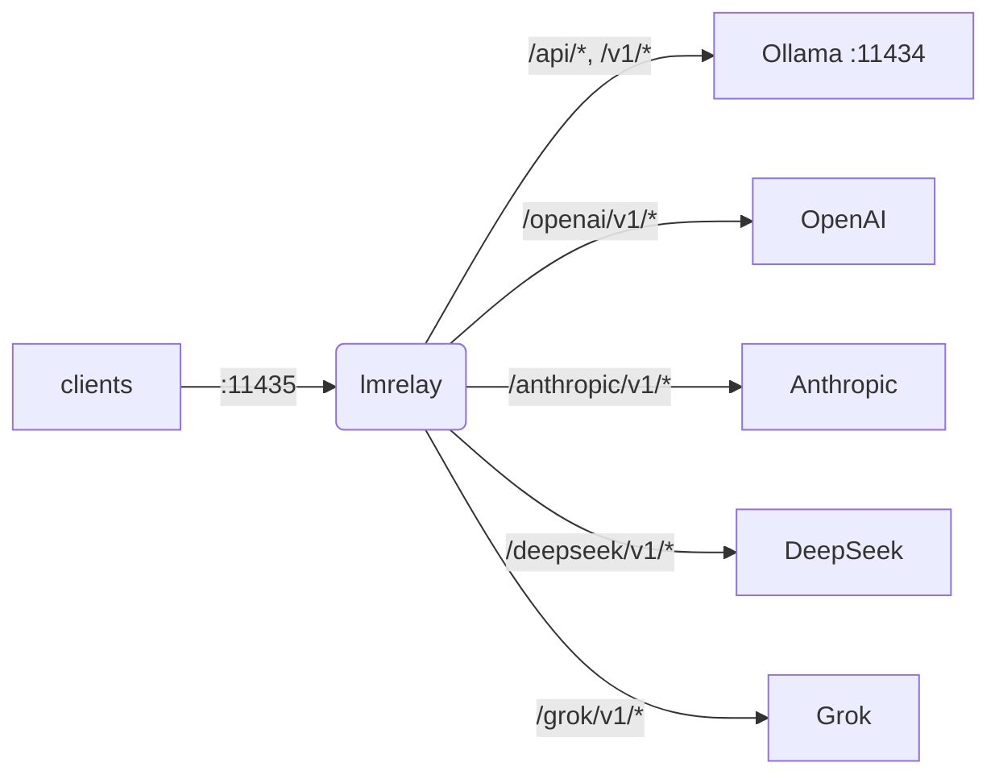

[English](https://github.com/wachawo/lmrelay/blob/main/README.md) | [Español](https://github.com/wachawo/lmrelay/blob/main/docs/README_ES.md) | [Português](https://github.com/wachawo/lmrelay/blob/main/docs/README_PT.md) | [Français](https://github.com/wachawo/lmrelay/blob/main/docs/README_FR.md) | [Deutsch](https://github.com/wachawo/lmrelay/blob/main/docs/README_DE.md) | **[Italiano](https://github.com/wachawo/lmrelay/blob/main/docs/README_IT.md)** | [Русский](https://github.com/wachawo/lmrelay/blob/main/docs/README_RU.md) | [中文](https://github.com/wachawo/lmrelay/blob/main/docs/README_ZH.md) | [日本語](https://github.com/wachawo/lmrelay/blob/main/docs/README_JA.md) | [हिन्दी](https://github.com/wachawo/lmrelay/blob/main/docs/README_HI.md) | [한국어](https://github.com/wachawo/lmrelay/blob/main/docs/README_KR.md)

## lmrelay - un relay con credenziali accanto a un Ollama locale

[](https://github.com/wachawo/lmrelay/blob/main/LICENSE)
[](https://github.com/wachawo/lmrelay)
[](https://github.com/wachawo/lmrelay)
[](https://github.com/wachawo/lmrelay/blob/main/pyproject.toml)

Un piccolo relay HTTP che ascolta sulla 11435 accanto a un [Ollama](https://ollama.com) locale, può richiedere una credenziale ai propri chiamanti e raggiunge un provider hosted anteponendo un segmento di percorso.



### Requisiti

- Python 3.11 o superiore e tre dipendenze: FastAPI, uvicorn e httpx.
- Linux e macOS eseguono tutti i comandi, compresi `serve` (in background) ed `enable`: una
  unit systemd `--user` su Linux, un agent launchd su macOS, e un rifiuto dove non è
  installato nessuno dei due.
- Windows esegue solo `run`. `serve` segnala che la piattaforma non ha `os.fork`, ed `enable`
  che non c'è né systemd né launchd, invece di avviarsi a metà.
- Un Ollama locale sulla 11434 è l'upstream predefinito, ma non è obbligatorio. Un relay con
  configurati solo provider hosted è valido, purché `default_upstream` ne nomini uno.

### Installazione

```bash
pip install git+https://github.com/wachawo/lmrelay.git
```

Il prefisso `git+` non è un ornamento: pip legge un `github.com/...` nudo come nome di
pacchetto e fallisce. Dove git non è installato funziona l'archivio dei sorgenti, che non ne
ha bisogno:

```bash
pip install https://github.com/wachawo/lmrelay/archive/refs/heads/main.tar.gz
```

### Avvio rapido

```bash
lmrelay init     # writes ~/.lmrelay/lmrelay.toml
lmrelay run      # foreground, port 11435
```

Ollama mantiene la 11434 e la sua installazione resta esattamente com'è. Sono invece i client
a essere ripuntati sulla 11435. È questo il compromesso: nulla di un Ollama esistente deve
cambiare, e il relay si adotta client per client.

In uno stato appena creato l'autenticazione è disattivata, quindi su loopback questo è un
proxy trasparente davanti a Ollama. È voluto: un relay appena installato non deve precludere
l'accesso al proprio Ollama prima di avere un token. Basta puntare un client sulla 11435 e
funziona:

```bash
OLLAMA_HOST=127.0.0.1:11435 ollama list
```

### Metterlo in esercizio

```bash
lmrelay token gen --label laptop   # prints the token once, turns auth on
lmrelay enable                     # start at login, and start now
lmrelay status
```

```
lmrelay      running (pid 40213), healthy
listening    127.0.0.1:11435
config       /home/u/.lmrelay/lmrelay.toml
state        /home/u/.lmrelay/state.json
upstreams    anthropic, ollama, openai (default: ollama)
auth         on, 2 tokens
autostart    systemd: enabled, active
```

`enable` registra una unit systemd `--user` su Linux o un agent launchd su macOS, poi la
avvia. Da quel momento `stop`, `restart` e `reload` passano per quel gestore anziché per il
pidfile, così i due non possono discordare su chi possiede il processo. Su una macchina POSIX
priva di entrambi i gestori, `lmrelay serve` esegue il relay in background.

### Utilizzo

| Comando | Cosa fa |
|---|---|
| `lmrelay init` | scrive `~/.lmrelay/lmrelay.toml` |
| `lmrelay run` | esegue in primo piano |
| `lmrelay serve` | esegue in background, accodando a `lmrelay.log` |
| `lmrelay stop` | arresta il relay in esecuzione |
| `lmrelay restart` | lo arresta, poi lo riavvia in background |
| `lmrelay reload` | rilegge la configurazione senza far cadere una connessione |
| `lmrelay status` | cosa è in esecuzione, dove, con quali upstream |
| `lmrelay enable` | avvia al login, e avvia subito |
| `lmrelay disable` | annulla `enable` |
| `lmrelay auth true\|false` | richiede una credenziale al chiamante, oppure no |
| `lmrelay token gen [--label L]` | genera un token e lo stampa una sola volta |
| `lmrelay token add TOKEN [--label L]` | registra un token scelto dall'utente |
| `lmrelay token list [--show]` | elenca i token, mascherati salvo `--show` |
| `lmrelay token delete ID` | ne rimuove uno tramite l'id stampato da `token list` |
| `lmrelay provider add NAME TOKEN` | aggiunge o ruota un upstream |
| `lmrelay provider list [--show]` | tutti gli upstream, dal file e dallo stato |
| `lmrelay provider delete NAME` | rimuove un provider di proprietà dello stato |

`run`, `serve` e `restart` accettano `--host` e `--port`. `provider add` accetta `--base-url`,
`--dialect` e un `--header K=V` ripetibile; con un nome noto — `openai`, `anthropic`,
`deepseek`, `grok`, `ollama` — l'URL di base, il dialetto e la forma degli header arrivano da
un preset, quindi `lmrelay provider add openai sk-...` è l'intero comando. `--config PATH` è
accettato da ogni comando che legge la configurazione o lo stato, cioè da ogni comando tranne
`init`, che scrive sempre `~/.lmrelay/lmrelay.toml`, e `disable`, che non legge né l'una né
l'altro.

### Scelta dell'upstream

Il primo segmento del percorso seleziona l'upstream se e solo se corrisponde esattamente a una
chiave in `[upstream]`. Altrimenti la richiesta è gestita da `default_upstream` e il percorso
resta intatto.

```
POST /api/chat                      -> ollama    , forwards /api/chat
POST /v1/chat/completions           -> ollama    , forwards /v1/chat/completions
POST /openai/v1/chat/completions    -> openai    , forwards /v1/chat/completions
POST /anthropic/v1/messages         -> anthropic , forwards /v1/messages
POST /deepseek/v1/chat/completions  -> deepseek  , forwards /v1/chat/completions
POST /grok/v1/chat/completions      -> grok      , forwards /v1/chat/completions
```

Così un client impara la porta una volta sola, e ridirigerlo verso un provider diverso è
questione di una riga:

```python
from openai import OpenAI
from anthropic import Anthropic

OpenAI(base_url="http://relay:11435/openai/v1", api_key=RELAY_TOKEN)
OpenAI(base_url="http://relay:11435/v1",        api_key=RELAY_TOKEN)   # local Ollama
Anthropic(base_url="http://relay:11435/anthropic", api_key=RELAY_TOKEN)
```

```bash
curl http://127.0.0.1:11435/api/chat \
  -H "Authorization: Bearer $LMRELAY_TOKEN" \
  -d '{"model": "llama3", "messages": [{"role": "user", "content": "hi"}]}'
```

`GET /healthz` risponde `{"status": "ok"}` senza toccare un upstream e senza credenziale.
Tutto il resto passa per il relay.

### Compatibilità

lmrelay inoltra metodo, percorso, query string e byte del corpo **invariati**, e non traduce
tra dialetti di API.

| Il client parla | Percorso che usa | ollama | openai | deepseek | grok | anthropic |
|---|---|:--:|:--:|:--:|:--:|:--:|
| API Ollama | `/api/chat`, `/api/generate`, `/api/tags` | yes | no | no | no | no |
| API OpenAI | `/v1/chat/completions`, `/v1/models` | yes¹ | yes | yes | yes | no |
| API Anthropic | `/v1/messages` | no | no | no | no | yes |

¹ Ollama espone una superficie compatibile con OpenAI su `/v1/*` accanto alle sue `/api/*`
native. È la cella che conta nella pratica: un client in forma OpenAI raggiunge **tutti** —
ollama, openai, deepseek e grok — cambiando solo il prefisso del percorso.

I quattro casi che non funzionano, e il motivo per cui nessuno di essi può essere fatto
funzionare, stanno nel documento di configurazione.

Dove lmrelay può stabilire che un percorso a monte certamente non esiste, lo dichiara da sé
invece di lasciare che il 404 del provider sembri un errore dell'utente:

```json
{"error": "lmrelay: upstream 'anthropic' speaks the Anthropic API; '/v1/chat/completions' is an OpenAI-dialect path. lmrelay forwards requests unchanged and does not translate between dialects."}
```

Ogni errore generato da lmrelay inizia con `lmrelay: `, così non viene mai scambiato per
qualcosa detto dal provider.

**[Configurazione ed errori](https://github.com/wachawo/lmrelay/blob/main/docs/CONFIGURATION.md)** - il file di configurazione, i token dei chiamanti, i provider, l'avvio automatico, il comportamento dello streaming e il significato di ogni errore.

### Test

```sh
pip install -e '.[test]'
pytest
```

Gran parte della suite pilota l'applicazione in-process contro un upstream che registra le
richieste, quindi non serve né rete né Ollama. L'eccezione è
[`tests/test_streaming.py`](../tests/test_streaming.py): esegue il relay sotto uvicorn davanti a
un upstream che risponde un chunk alla volta, perché la proprietà che verifica — che il
chiamante abbia la prima riga prima che l'upstream abbia scritto l'ultima — non è osservabile
attraverso un client in-process.

### Licenza

Licenza MIT. Vedi [LICENSE](../LICENSE).
