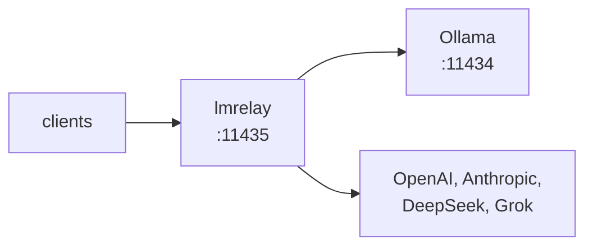

## lmrelay - ローカルの Ollama の隣に置く、資格情報つきリレー

[](https://github.com/wachawo/lmrelay/actions/workflows/ci.yml)
[](https://github.com/wachawo/lmrelay/blob/main/LICENSE)
[](https://github.com/wachawo/lmrelay)
[](https://github.com/wachawo/lmrelay)
[](https://github.com/wachawo/lmrelay/blob/main/pyproject.toml)

ローカルの [Ollama](https://ollama.com) の隣で 11435 を待ち受ける小さな HTTP リレー。呼び出し元に資格情報を要求でき、パスの先頭にセグメントを 1 つ付けるだけでホスト型プロバイダに届く。

[English](https://github.com/wachawo/lmrelay/blob/main/README.md) | [Español](https://github.com/wachawo/lmrelay/blob/main/docs/README_ES.md) | [Português](https://github.com/wachawo/lmrelay/blob/main/docs/README_PT.md) | [Français](https://github.com/wachawo/lmrelay/blob/main/docs/README_FR.md) | [Deutsch](https://github.com/wachawo/lmrelay/blob/main/docs/README_DE.md) | [Italiano](https://github.com/wachawo/lmrelay/blob/main/docs/README_IT.md) | [Русский](https://github.com/wachawo/lmrelay/blob/main/docs/README_RU.md) | [中文](https://github.com/wachawo/lmrelay/blob/main/docs/README_ZH.md) | **[日本語](https://github.com/wachawo/lmrelay/blob/main/docs/README_JA.md)** | [हिन्दी](https://github.com/wachawo/lmrelay/blob/main/docs/README_HI.md) | [한국어](https://github.com/wachawo/lmrelay/blob/main/docs/README_KR.md)



Ollama 自身には認証がない。ループバックの外に公開して、ローカルネットワークの他のマシンから届く
ようにするには、これまで何かをその前に置くしかなかった。実際には nginx だ。lmrelay はその 1 つの
仕事を pip で入れるデーモンにしたものであり、その仕事しかしない。

### 要件

- Python 3.11 以上と、4 つの依存パッケージ: FastAPI、starlette、uvicorn、httpx。
- Linux と macOS はすべてのコマンドを実行できる。`serve`（デタッチ実行）と `enable` も含む。
  `enable` は Linux では systemd の `--user` ユニット、macOS では launchd エージェントで、
  どちらも入っていない環境では拒否する。
- Windows で動くのは `run` だけ。中途半端に起動せず、`serve` はこのプラットフォームに
  `os.fork` がないと報告し、`enable` は systemd も launchd もないと報告する。
- 11434 のローカル Ollama が既定のアップストリームだが、必須ではない。ホスト型プロバイダだけを
  設定したリレーも、`default_upstream` がそのいずれかを指していれば成立する。

### インストール

```bash
pip install git+https://github.com/wachawo/lmrelay.git
```

`git+` は飾りではない。`github.com/...` をそのまま渡すと、pip はそれをパッケージ名として読み、
失敗する。git が入っていない環境では、git を必要としないソースアーカイブが使える:

```bash
pip install https://github.com/wachawo/lmrelay/archive/refs/heads/main.tar.gz
```

### クイックスタート

```bash
lmrelay init     # writes ~/.lmrelay/lmrelay.toml
lmrelay run      # foreground, port 11435
```

Ollama は 11434 を持ったままで、そのインストール状態にはまったく手を触れない。代わりにクライアント
の向き先を 11435 に変える。これが引き換えだ。既存の Ollama について何も変える必要がなく、リレーは
クライアントごとに任意で使える。

新しい state では認証はオフなので、ループバック上では Ollama の前に置いた透過プロキシになる。これ
は意図的だ。入れたばかりのリレーが、トークンを手にする前に自分の Ollama から締め出してはならない。
クライアントを 11435 に向ければ、それで動く:

```bash
OLLAMA_HOST=127.0.0.1:11435 ollama list
```

### 動作確認

リレーにモデル一覧を要求する。どちらの方言でもよく、どちらも同じ Ollama に届く:

```bash
curl http://127.0.0.1:11435/api/tags    # Ollama's shape
curl http://127.0.0.1:11435/v1/models   # OpenAI's shape
```

次にモデルを動かす。ここでの `qwen3:8b` は、手元で `ollama list` が表示する名前に置き換える:

```bash
curl http://127.0.0.1:11435/api/generate -d '{
  "model": "qwen3:8b",
  "prompt": "Reply with exactly: it works",
  "stream": false,
  "think": false
}'
```

```bash
curl http://127.0.0.1:11435/v1/chat/completions \
  -H "Content-Type: application/json" \
  -d '{
  "model": "qwen3:8b",
  "messages": [{"role": "user", "content": "say ok"}]
}'
```

`qwen3` は回答の前に推論する。その切り替えがあるのは Ollama の方言だけで、上の `"think": false` がそれにあたる。`/v1/chat/completions` 経由では、推論は `<think>` ブロックとして content の中に届く。lmrelay は上流が生成したものをそのまま転送し、手を加えないからである。

認証を有効にすると、これらはいずれも資格情報を必要とする:

```bash
curl http://127.0.0.1:11435/api/tags \
  -H "Authorization: Bearer $LMRELAY_TOKEN"
```

### 実運用で動かす

```bash
lmrelay token gen --label laptop   # printed once, never again
lmrelay auth true                  # now start requiring it
lmrelay enable                     # start at login, and start now
lmrelay status
```

```
lmrelay      running (pid 40213), healthy
listening    127.0.0.1:11435
config       /home/u/.lmrelay/lmrelay.toml
state        /home/u/.lmrelay/state.json
upstreams    anthropic, ollama, openai (default: ollama)
auth         on, 2 tokens
autostart    systemd: enabled, active
```

`enable` は Linux では systemd の `--user` ユニットを、macOS では launchd エージェントを登録し、
そのまま起動する。以後 `stop`、`restart`、`reload` は pidfile ではなくそのマネージャを経由するので、
プロセスの持ち主について両者の言い分が食い違うことはない。どちらのマネージャもない POSIX 環境では、
`lmrelay serve` がリレーをデタッチして動かす。

### 使い方

| コマンド | 動作 |
|---|---|
| `lmrelay init` | `~/.lmrelay/lmrelay.toml` を書く |
| `lmrelay run` | フォアグラウンドで実行する |
| `lmrelay serve` | デタッチして実行し、`lmrelay.log` に追記する |
| `lmrelay stop` | 動作中のリレーを停止する |
| `lmrelay restart` | 停止して、再びデタッチで起動する |
| `lmrelay reload` | 接続を落とさずに設定を読み直す |
| `lmrelay status` | 何が、どこで、どのアップストリームで動いているか |
| `lmrelay enable` | ログイン時に起動し、いま起動する |
| `lmrelay disable` | `enable` を取り消す |
| `lmrelay auth true\|false` | 呼び出し元に資格情報を要求する、またはしない |
| `lmrelay token gen [--label L]` | トークンを発行し、一度だけ表示する |
| `lmrelay token add TOKEN [--label L]` | 自分で選んだトークンを登録する |
| `lmrelay token list [--show]` | トークンを一覧する。`--show` がなければマスクされる |
| `lmrelay token delete ID` | `token list` が表示する id で 1 つ削除する |
| `lmrelay provider add NAME TOKEN` | アップストリームを追加、またはローテーションする |
| `lmrelay provider list [--show]` | ファイルと state の両方から、すべてのアップストリーム |
| `lmrelay provider delete NAME` | state が所有するプロバイダを削除する |

`run`、`serve`、`restart` は `--host` と `--port` を取る。`provider add` は `--base-url`、
`--dialect`、および繰り返し指定できる `--header K=V` を取る。名前が既知のもの — `openai`、
`anthropic`、`deepseek`、`grok`、`ollama` — なら、ベース URL、方言、ヘッダの形はプリセットから
来るので、`lmrelay provider add openai sk-...` だけでコマンドは終わる。`--config PATH` は設定
または state を読むすべてのコマンドが受け付ける。つまり `init` と `disable` 以外のすべてだ。
`init` は常に `~/.lmrelay/lmrelay.toml` を書き、`disable` はどちらも読まない。

### アップストリームの選択

パスの最初のセグメントがアップストリームを選ぶのは、それが `[upstream]` のキーと完全に一致する
場合に限る。一致しなければ `default_upstream` がリクエストを処理し、パスには手を触れない。

```
POST /api/chat                     -> ollama     /api/chat
POST /v1/chat/completions          -> ollama     /v1/chat/completions
POST /openai/v1/chat/completions   -> openai     /v1/chat/completions
POST /anthropic/v1/messages        -> anthropic  /v1/messages
POST /deepseek/v1/chat/completions -> deepseek   /v1/chat/completions
POST /grok/v1/chat/completions     -> grok       /v1/chat/completions
```

したがってクライアントが覚えるポートは一度きりで、別のプロバイダに向け直すのは 1 行で済む:

```python
from openai import OpenAI
from anthropic import Anthropic

OpenAI(base_url="http://relay:11435/openai/v1", api_key=RELAY_TOKEN)
OpenAI(base_url="http://relay:11435/v1", api_key=RELAY_TOKEN)  # Ollama
Anthropic(base_url="http://relay:11435/anthropic", api_key=RELAY_TOKEN)
```

```bash
curl http://127.0.0.1:11435/api/chat \
  -H "Authorization: Bearer $LMRELAY_TOKEN" \
  -d '{
  "model": "llama3",
  "messages": [{"role": "user", "content": "hi"}]
}'
```

`GET /healthz` はアップストリームに触れず、資格情報も要求せずに `{"status": "ok"}` を返す。
それ以外はすべてリレーを通る。

### 互換性

lmrelay はメソッド、パス、クエリ文字列、ボディのバイト列を**そのまま**転送し、API 方言のあいだで
変換はしない。

| クライアントが話す API | 使うパス | ollama | openai | deepseek | grok | anthropic |
|---|---|:--:|:--:|:--:|:--:|:--:|
| Ollama API | `/api/chat`, `/api/generate`, `/api/tags` | yes | no | no | no | no |
| OpenAI API | `/v1/chat/completions`, `/v1/models` | yes¹ | yes | yes | yes | no |
| Anthropic API | `/v1/messages` | no | no | no | no | yes |

¹ Ollama はネイティブの `/api/*` と並べて、`/v1/*` に OpenAI 互換の面を出している。実用上重要な
のはこのセルだ。OpenAI 形式のクライアントは、パスの接頭辞を変えるだけで ollama、openai、
deepseek、grok の**すべて**に届く。

動かない 4 つのケースと、それぞれがなぜ動くようにできないのかは、設定ドキュメントにある。

アップストリームにそのパスが確実に存在しないと lmrelay が判断できる場合、lmrelay は自分でそう言う。
プロバイダの 404 があなたの間違いのように見えるのを避けるためだ:

```text
lmrelay: upstream 'anthropic' speaks the Anthropic API;
'/v1/chat/completions' is an OpenAI-dialect path. lmrelay
forwards requests unchanged and does not translate between
dialects.
```

lmrelay が生成するエラーはすべて `lmrelay: ` で始まるので、プロバイダが返したものと取り違えられる
ことはない。

**[設定とエラー](https://github.com/wachawo/lmrelay/blob/main/docs/CONFIGURATION.md)** - 設定ファイル、呼び出し元トークン、プロバイダ、自動起動、ストリーミングの挙動、そして各エラーの意味。

### テスト

```sh
pip install -e '.[test]'
pytest
```

スイートの大半は、記録用のアップストリームを相手にアプリをインプロセスで動かすので、ネットワークも
Ollama も要らない。例外は [`tests/test_streaming.py`](../tests/test_streaming.py) で、チャンクを
1 つずつ返すアップストリームの前でリレーを uvicorn 上で走らせる。確かめたい性質 — アップストリーム
が最後の行を書き終える前に、呼び出し元が最初の行を受け取っていること — は、インプロセスの
クライアント越しには観測できないからだ。

### ライセンス

MIT License。[LICENSE](../LICENSE) を参照。
