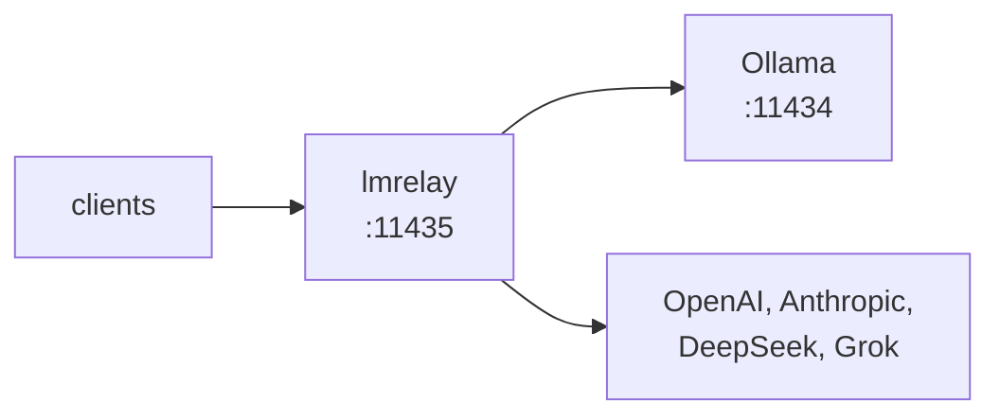

## lmrelay - 로컬 Ollama 옆에 두는 자격 증명 릴레이

[](https://github.com/wachawo/lmrelay/blob/main/LICENSE)
[](https://github.com/wachawo/lmrelay)
[](https://github.com/wachawo/lmrelay)
[](https://github.com/wachawo/lmrelay/blob/main/pyproject.toml)

로컬 [Ollama](https://ollama.com) 옆에서 11435 포트를 수신하는 작은 HTTP 릴레이입니다. 호출자에게 자격 증명을 요구할 수 있고, 경로 앞에 세그먼트 하나를 붙이면 호스팅 제공자로 연결합니다.

[English](https://github.com/wachawo/lmrelay/blob/main/README.md) | [Español](https://github.com/wachawo/lmrelay/blob/main/docs/README_ES.md) | [Português](https://github.com/wachawo/lmrelay/blob/main/docs/README_PT.md) | [Français](https://github.com/wachawo/lmrelay/blob/main/docs/README_FR.md) | [Deutsch](https://github.com/wachawo/lmrelay/blob/main/docs/README_DE.md) | [Italiano](https://github.com/wachawo/lmrelay/blob/main/docs/README_IT.md) | [Русский](https://github.com/wachawo/lmrelay/blob/main/docs/README_RU.md) | [中文](https://github.com/wachawo/lmrelay/blob/main/docs/README_ZH.md) | [日本語](https://github.com/wachawo/lmrelay/blob/main/docs/README_JA.md) | [हिन्दी](https://github.com/wachawo/lmrelay/blob/main/docs/README_HI.md) | **[한국어](https://github.com/wachawo/lmrelay/blob/main/docs/README_KR.md)**



### 요구 사항

- Python 3.11 이상, 그리고 세 개의 의존성: FastAPI, uvicorn, httpx.
- Linux와 macOS는 모든 명령을 실행합니다. `serve`(분리 실행)와 `enable`도 포함합니다. `enable`은
  Linux에서는 systemd `--user` 유닛, macOS에서는 launchd 에이전트를 쓰며, 둘 다 설치돼 있지 않은
  곳에서는 거부합니다.
- Windows는 `run`만 실행합니다. 절반만 시작하는 대신, `serve`는 이 플랫폼에 `os.fork`가 없다고
  알리고 `enable`은 systemd도 launchd도 없다고 알립니다.
- 11434의 로컬 Ollama가 기본 업스트림이지만 필수는 아닙니다. 호스팅 제공자만 설정한 릴레이도
  `default_upstream`이 그중 하나를 가리키기만 하면 유효합니다.

### 설치

```bash
pip install git+https://github.com/wachawo/lmrelay.git
```

`git+` 접두사는 장식이 아닙니다. pip은 접두사 없는 `github.com/...`을 패키지 이름으로 읽고 실패합니다.
git이 없는 환경에서는 소스 아카이브를 쓰면 되고, 이 방식은 git이 필요 없습니다:

```bash
pip install https://github.com/wachawo/lmrelay/archive/refs/heads/main.tar.gz
```

### 빠른 시작

```bash
lmrelay init     # writes ~/.lmrelay/lmrelay.toml
lmrelay run      # foreground, port 11435
```

Ollama는 11434를 그대로 쓰고 설치 상태도 전혀 건드리지 않습니다. 대신 클라이언트를 11435로 다시
향하게 합니다. 이것이 맞바꾸는 조건입니다. 기존 Ollama는 아무것도 바꿀 필요가 없고, 릴레이는
클라이언트마다 선택해서 적용합니다.

새 상태에서는 인증이 꺼져 있으므로, 루프백에서 이것은 Ollama 앞에 놓인 투명 프록시입니다. 의도한
동작입니다. 방금 설치한 릴레이가 토큰을 만들기도 전에 사용자를 자기 Ollama에서 차단해서는 안 됩니다.
클라이언트를 11435로 향하게 하면 그대로 동작합니다:

```bash
OLLAMA_HOST=127.0.0.1:11435 ollama list
```

### 동작 확인

릴레이에 모델 목록을 요청합니다. 두 방언 중 어느 쪽이든 같은 Ollama에 도달합니다:

```bash
curl http://127.0.0.1:11435/api/tags     # Ollama's own shape
curl http://127.0.0.1:11435/v1/models    # the OpenAI-compatible shape
```

그다음 모델을 실제로 돌려봅니다. 여기서 `qwen3:8b`는 각자의 머신에서 `ollama list`가 보여주는 이름입니다:

```bash
curl http://127.0.0.1:11435/api/generate \
  -d '{"model": "qwen3:8b", "prompt": "Reply with exactly: it works", "stream": false, "think": false}'
```

```bash
curl http://127.0.0.1:11435/v1/chat/completions \
  -H "Content-Type: application/json" \
  -d '{"model": "qwen3:8b", "messages": [{"role": "user", "content": "say ok"}]}'
```

`qwen3`는 답하기 전에 추론하며, 그 스위치는 Ollama 방언에만 있습니다. 위의 `"think": false`가 그것입니다. `/v1/chat/completions`를 거치면 추론은 content 안에 `<think>` 블록으로 도착합니다. lmrelay는 업스트림이 만든 것을 그대로 전달하고 편집하지 않기 때문입니다.

인증을 켜면 이 요청들 모두 자격 증명이 필요합니다:

```bash
curl -H "Authorization: Bearer $LMRELAY_TOKEN" http://127.0.0.1:11435/api/tags
```

### 실제로 운용하기

```bash
lmrelay token gen --label laptop   # prints the token once, turns auth on
lmrelay enable                     # start at login, and start now
lmrelay status
```

```
lmrelay      running (pid 40213), healthy
listening    127.0.0.1:11435
config       /home/u/.lmrelay/lmrelay.toml
state        /home/u/.lmrelay/state.json
upstreams    anthropic, ollama, openai (default: ollama)
auth         on, 2 tokens
autostart    systemd: enabled, active
```

`enable`은 Linux에서는 systemd `--user` 유닛을, macOS에서는 launchd 에이전트를 등록한 뒤 시작합니다.
그다음부터 `stop`, `restart`, `reload`는 pidfile이 아니라 그 관리자를 거치므로, 둘이 프로세스의 주인을
두고 어긋날 수 없습니다. 두 관리자가 모두 없는 POSIX 환경에서는 `lmrelay serve`가 릴레이를 분리
실행합니다.

### 사용법

| 명령 | 동작 |
|---|---|
| `lmrelay init` | `~/.lmrelay/lmrelay.toml`을 씁니다 |
| `lmrelay run` | 포그라운드로 실행합니다 |
| `lmrelay serve` | 분리 실행하며 `lmrelay.log`에 이어 씁니다 |
| `lmrelay stop` | 실행 중인 릴레이를 멈춥니다 |
| `lmrelay restart` | 멈춘 뒤 다시 분리 실행합니다 |
| `lmrelay reload` | 연결을 끊지 않고 설정을 다시 읽습니다 |
| `lmrelay status` | 무엇이 어디서 어떤 업스트림으로 실행 중인지 |
| `lmrelay enable` | 로그인할 때 시작하고, 지금도 시작합니다 |
| `lmrelay disable` | `enable`을 되돌립니다 |
| `lmrelay auth true\|false` | 호출자 자격 증명을 요구하거나, 요구하지 않습니다 |
| `lmrelay token gen [--label L]` | 토큰을 발급하고 한 번만 출력합니다 |
| `lmrelay token add TOKEN [--label L]` | 직접 고른 토큰을 등록합니다 |
| `lmrelay token list [--show]` | 토큰 목록. `--show` 없이는 마스킹합니다 |
| `lmrelay token delete ID` | `token list`가 출력한 id로 하나를 제거합니다 |
| `lmrelay provider add NAME TOKEN` | 업스트림을 추가하거나 교체합니다 |
| `lmrelay provider list [--show]` | 파일과 상태에 있는 모든 업스트림 |
| `lmrelay provider delete NAME` | 상태가 소유한 제공자를 제거합니다 |

`run`, `serve`, `restart`는 `--host`와 `--port`를 받습니다. `provider add`는 `--base-url`,
`--dialect`, 그리고 여러 번 쓸 수 있는 `--header K=V`를 받습니다. 이름이 알려진 경우 — `openai`,
`anthropic`, `deepseek`, `grok`, `ollama` — 기본 URL과 dialect, 헤더 형태를 프리셋에서 가져오므로
`lmrelay provider add openai sk-...` 한 줄이면 끝입니다. `--config PATH`는 설정이나 상태를 읽는 모든
명령이 받습니다. 즉 `init`과 `disable`을 뺀 모든 명령이며, `init`은 언제나
`~/.lmrelay/lmrelay.toml`에 쓰고 `disable`은 둘 다 읽지 않습니다.

### 업스트림 선택

첫 번째 경로 세그먼트가 `[upstream]`의 키와 정확히 일치할 때에만 그 세그먼트가 업스트림을
선택합니다. 그 밖에는 `default_upstream`이 요청을 처리하고 경로는 건드리지 않습니다.

```
POST /api/chat                      -> ollama    , forwards /api/chat
POST /v1/chat/completions           -> ollama    , forwards /v1/chat/completions
POST /openai/v1/chat/completions    -> openai    , forwards /v1/chat/completions
POST /anthropic/v1/messages         -> anthropic , forwards /v1/messages
POST /deepseek/v1/chat/completions  -> deepseek  , forwards /v1/chat/completions
POST /grok/v1/chat/completions      -> grok      , forwards /v1/chat/completions
```

그래서 클라이언트는 포트를 한 번만 익히면 되고, 하나를 다른 제공자로 돌리는 일은 한 줄이면
끝납니다:

```python
from openai import OpenAI
from anthropic import Anthropic

OpenAI(base_url="http://relay:11435/openai/v1", api_key=RELAY_TOKEN)
OpenAI(base_url="http://relay:11435/v1",        api_key=RELAY_TOKEN)   # local Ollama
Anthropic(base_url="http://relay:11435/anthropic", api_key=RELAY_TOKEN)
```

```bash
curl http://127.0.0.1:11435/api/chat \
  -H "Authorization: Bearer $LMRELAY_TOKEN" \
  -d '{"model": "llama3", "messages": [{"role": "user", "content": "hi"}]}'
```

`GET /healthz`는 업스트림을 건드리지 않고 자격 증명도 없이 `{"status": "ok"}`를 응답합니다. 나머지는
모두 릴레이를 거칩니다.

### 호환성

lmrelay는 메서드, 경로, 쿼리 문자열, 본문 바이트를 **그대로** 전달하며, API dialect 사이를 변환하지
않습니다.

| 클라이언트가 쓰는 API | 사용하는 경로 | ollama | openai | deepseek | grok | anthropic |
|---|---|:--:|:--:|:--:|:--:|:--:|
| Ollama API | `/api/chat`, `/api/generate`, `/api/tags` | yes | no | no | no | no |
| OpenAI API | `/v1/chat/completions`, `/v1/models` | yes¹ | yes | yes | yes | no |
| Anthropic API | `/v1/messages` | no | no | no | no | yes |

¹ Ollama는 네이티브 `/api/*`와 함께 `/v1/*`에서 OpenAI 호환 표면을 제공합니다. 실무에서 중요한 칸이
바로 여기입니다. OpenAI 형태의 클라이언트는 경로 접두사만 바꿔서 ollama, openai, deepseek, grok
**전부**에 도달합니다.

동작하지 않는 네 가지 경우와, 각각을 동작하게 만들 수 없는 이유는 설정 문서에 있습니다.

어떤 경로가 업스트림에 확실히 존재하지 않는다고 lmrelay가 판단할 수 있으면, 제공자의 404가 사용자의
실수처럼 보이도록 두지 않고 직접 그렇게 알립니다:

```json
{"error": "lmrelay: upstream 'anthropic' speaks the Anthropic API; '/v1/chat/completions' is an OpenAI-dialect path. lmrelay forwards requests unchanged and does not translate between dialects."}
```

lmrelay가 만들어 내는 모든 오류는 `lmrelay: `로 시작하므로, 제공자가 한 말로 오해할 일이 없습니다.

**[설정과 오류](https://github.com/wachawo/lmrelay/blob/main/docs/CONFIGURATION.md)** - 설정 파일, 호출자 토큰, 제공자, 자동 시작, 스트리밍 동작, 그리고 각 오류가 뜻하는 것.

### 테스트

```sh
pip install -e '.[test]'
pytest
```

테스트 대부분은 기록된 업스트림을 상대로 앱을 인프로세스로 구동하므로 네트워크도 Ollama도 필요
없습니다. [`tests/test_streaming.py`](../tests/test_streaming.py)는 예외입니다. 한 번에 한 청크씩
응답하는 업스트림 앞에서 릴레이를 uvicorn으로 실행합니다. 이 테스트가 확인하는 성질 — 업스트림이
마지막 줄을 쓰기 전에 호출자가 첫 줄을 받는다는 것 — 은 인프로세스 클라이언트로는 볼 수 없기
때문입니다.

### 라이선스

MIT License. [LICENSE](../LICENSE)를 참고합니다.
