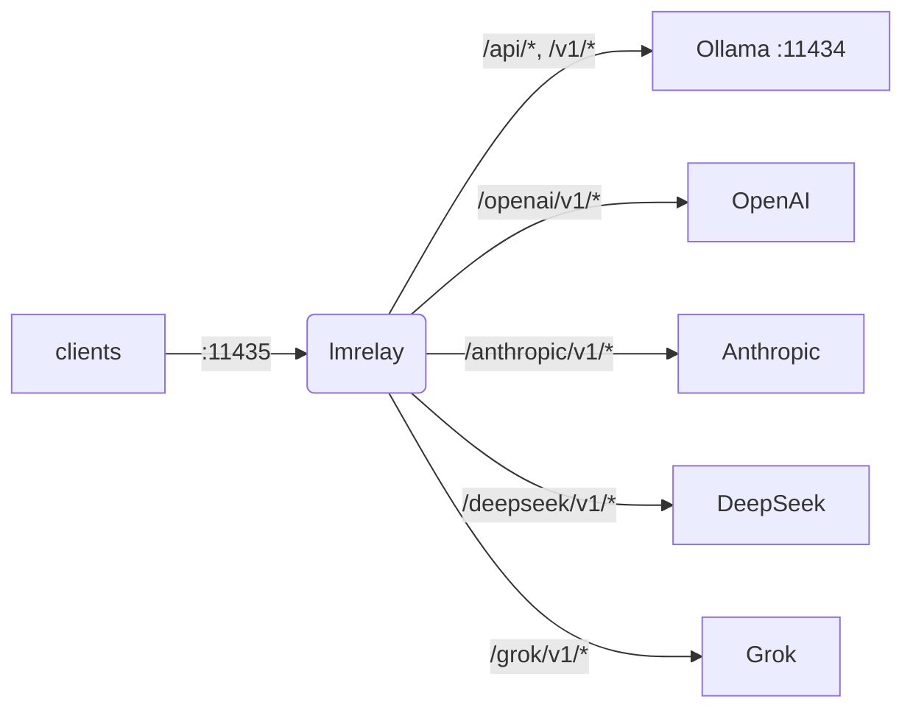

## lmrelay - um relay com credenciais ao lado de um Ollama local

[](https://github.com/wachawo/lmrelay/blob/main/LICENSE)
[](https://github.com/wachawo/lmrelay)
[](https://github.com/wachawo/lmrelay)
[](https://github.com/wachawo/lmrelay/blob/main/pyproject.toml)

Um pequeno relay HTTP que escuta na 11435 ao lado de um [Ollama](https://ollama.com) local, pode exigir uma credencial de quem o chama e alcança um provedor hospedado prefixando um segmento de caminho.

[English](https://github.com/wachawo/lmrelay/blob/main/README.md) | [Español](https://github.com/wachawo/lmrelay/blob/main/docs/README_ES.md) | **[Português](https://github.com/wachawo/lmrelay/blob/main/docs/README_PT.md)** | [Français](https://github.com/wachawo/lmrelay/blob/main/docs/README_FR.md) | [Deutsch](https://github.com/wachawo/lmrelay/blob/main/docs/README_DE.md) | [Italiano](https://github.com/wachawo/lmrelay/blob/main/docs/README_IT.md) | [Русский](https://github.com/wachawo/lmrelay/blob/main/docs/README_RU.md) | [中文](https://github.com/wachawo/lmrelay/blob/main/docs/README_ZH.md) | [日本語](https://github.com/wachawo/lmrelay/blob/main/docs/README_JA.md) | [हिन्दी](https://github.com/wachawo/lmrelay/blob/main/docs/README_HI.md) | [한국어](https://github.com/wachawo/lmrelay/blob/main/docs/README_KR.md)



### Requisitos

- Python 3.11 ou superior e três dependências: FastAPI, uvicorn e httpx.
- Linux e macOS executam todos os comandos, inclusive `serve` (em segundo plano) e `enable`:
  uma unidade systemd `--user` no Linux, um agente launchd no macOS, e uma recusa onde nenhum
  dos dois está instalado.
- O Windows executa apenas `run`. `serve` informa que a plataforma não tem `os.fork`, e
  `enable` que não há systemd nem launchd, em vez de iniciar pela metade.
- Um Ollama local na 11434 é o upstream padrão, mas não é obrigatório. Um relay configurado
  apenas com provedores hospedados é válido, desde que `default_upstream` nomeie um deles.

### Instalação

```bash
pip install git+https://github.com/wachawo/lmrelay.git
```

O prefixo `git+` não é enfeite: o pip lê um `github.com/...` sem prefixo como nome de pacote
e falha. Onde o git não está instalado, o arquivo de código-fonte funciona e não precisa dele:

```bash
pip install https://github.com/wachawo/lmrelay/archive/refs/heads/main.tar.gz
```

### Início rápido

```bash
lmrelay init     # writes ~/.lmrelay/lmrelay.toml
lmrelay run      # foreground, port 11435
```

O Ollama fica com a 11434 e sua instalação permanece exatamente como está. Em vez disso, os
clientes são reapontados para a 11435. Essa é a troca: nada em um Ollama existente precisa
mudar, e o relay é opcional cliente a cliente.

A autenticação vem desligada em um estado novo, então em loopback isso é um proxy
transparente na frente do Ollama. Isso é deliberado: um relay que você acabou de instalar não
deve trancar você para fora do seu próprio Ollama antes de você ter um token. Aponte um
cliente para a 11435 e ele funciona:

```bash
OLLAMA_HOST=127.0.0.1:11435 ollama list
```

### Verificar que funciona

Peça ao relay a lista de modelos. Qualquer um dos dialetos serve; ambos chegam ao mesmo Ollama:

```bash
curl http://127.0.0.1:11435/api/tags     # Ollama's own shape
curl http://127.0.0.1:11435/v1/models    # the OpenAI-compatible shape
```

Depois coloque um modelo para trabalhar. Aqui `qwen3:8b` é o que `ollama list` mostrar na sua máquina:

```bash
curl http://127.0.0.1:11435/api/generate \
  -d '{"model": "qwen3:8b", "prompt": "Reply with exactly: it works", "stream": false, "think": false}'
```

```bash
curl http://127.0.0.1:11435/v1/chat/completions \
  -H "Content-Type: application/json" \
  -d '{"model": "qwen3:8b", "messages": [{"role": "user", "content": "say ok"}]}'
```

`qwen3` raciocina antes de responder, e só o dialeto do Ollama tem um interruptor para isso: o `"think": false` acima. Por `/v1/chat/completions` o raciocínio chega dentro do conteúdo como um bloco `<think>`, porque o lmrelay encaminha o que o upstream produziu e não o edita.

Com a autenticação ligada, todas estas requisições precisam da credencial:

```bash
curl -H "Authorization: Bearer $LMRELAY_TOKEN" http://127.0.0.1:11435/api/tags
```

### Rodando de verdade

```bash
lmrelay token gen --label laptop   # prints the token once, turns auth on
lmrelay enable                     # start at login, and start now
lmrelay status
```

```
lmrelay      running (pid 40213), healthy
listening    127.0.0.1:11435
config       /home/u/.lmrelay/lmrelay.toml
state        /home/u/.lmrelay/state.json
upstreams    anthropic, ollama, openai (default: ollama)
auth         on, 2 tokens
autostart    systemd: enabled, active
```

`enable` registra uma unidade systemd `--user` no Linux ou um agente launchd no macOS e então
a inicia. A partir daí, `stop`, `restart` e `reload` passam por esse gerenciador em vez do
pidfile, de modo que os dois não podem discordar sobre quem é dono do processo. Em uma
máquina POSIX sem nenhum dos dois gerenciadores, `lmrelay serve` executa o relay em segundo
plano.

### Uso

| Comando | Faz |
|---|---|
| `lmrelay init` | escreve `~/.lmrelay/lmrelay.toml` |
| `lmrelay run` | executa em primeiro plano |
| `lmrelay serve` | executa em segundo plano, anexando a `lmrelay.log` |
| `lmrelay stop` | para o relay em execução |
| `lmrelay restart` | para o relay e o inicia de novo em segundo plano |
| `lmrelay reload` | relê a configuração sem derrubar nenhuma conexão |
| `lmrelay status` | o que está rodando, onde e com quais upstreams |
| `lmrelay enable` | inicia no login e inicia agora |
| `lmrelay disable` | desfaz `enable` |
| `lmrelay auth true\|false` | exigir uma credencial de quem chama, ou não |
| `lmrelay token gen [--label L]` | gera um token e o imprime uma única vez |
| `lmrelay token add TOKEN [--label L]` | registra um token escolhido por você |
| `lmrelay token list [--show]` | lista os tokens, mascarados a menos que `--show` |
| `lmrelay token delete ID` | remove um pelo id que `token list` imprime |
| `lmrelay provider add NAME TOKEN` | adiciona ou rotaciona um upstream |
| `lmrelay provider list [--show]` | todos os upstreams, do arquivo e do estado |
| `lmrelay provider delete NAME` | remove um provedor que pertence ao estado |

`run`, `serve` e `restart` aceitam `--host` e `--port`. `provider add` aceita `--base-url`,
`--dialect` e um `--header K=V` repetível; com um nome conhecido — `openai`, `anthropic`,
`deepseek`, `grok`, `ollama` — a URL base, o dialeto e o formato do header vêm de um preset,
então `lmrelay provider add openai sk-...` é o comando inteiro. `--config PATH` é aceito por
todo comando que lê a configuração ou o estado — ou seja, todos menos `init`, que sempre
escreve `~/.lmrelay/lmrelay.toml`, e `disable`, que não lê nenhum dos dois.

### Escolhendo um upstream

O primeiro segmento do caminho seleciona o upstream se e somente se ele corresponder
exatamente a uma chave em `[upstream]`. Caso contrário, `default_upstream` atende a
requisição e o caminho fica intacto.

```
POST /api/chat                      -> ollama    , forwards /api/chat
POST /v1/chat/completions           -> ollama    , forwards /v1/chat/completions
POST /openai/v1/chat/completions    -> openai    , forwards /v1/chat/completions
POST /anthropic/v1/messages         -> anthropic , forwards /v1/messages
POST /deepseek/v1/chat/completions  -> deepseek  , forwards /v1/chat/completions
POST /grok/v1/chat/completions      -> grok      , forwards /v1/chat/completions
```

Assim, um cliente só precisa aprender a porta uma vez, e reapontá-lo para outro provedor é
uma única linha:

```python
from openai import OpenAI
from anthropic import Anthropic

OpenAI(base_url="http://relay:11435/openai/v1", api_key=RELAY_TOKEN)
OpenAI(base_url="http://relay:11435/v1",        api_key=RELAY_TOKEN)   # local Ollama
Anthropic(base_url="http://relay:11435/anthropic", api_key=RELAY_TOKEN)
```

```bash
curl http://127.0.0.1:11435/api/chat \
  -H "Authorization: Bearer $LMRELAY_TOKEN" \
  -d '{"model": "llama3", "messages": [{"role": "user", "content": "hi"}]}'
```

`GET /healthz` responde `{"status": "ok"}` sem tocar em nenhum upstream e sem credencial.
Todo o resto passa pelo relay.

### Compatibilidade

O lmrelay encaminha o método, o caminho, a query string e os bytes do corpo **sem alteração**,
e não traduz entre dialetos de API.

| Seu cliente fala | Caminho que ele usa | ollama | openai | deepseek | grok | anthropic |
|---|---|:--:|:--:|:--:|:--:|:--:|
| Ollama API | `/api/chat`, `/api/generate`, `/api/tags` | yes | no | no | no | no |
| OpenAI API | `/v1/chat/completions`, `/v1/models` | yes¹ | yes | yes | yes | no |
| Anthropic API | `/v1/messages` | no | no | no | no | yes |

¹ O Ollama expõe uma superfície compatível com OpenAI em `/v1/*` ao lado do seu `/api/*`
nativo. Esta é a célula que importa na prática: um cliente no formato OpenAI alcança **todos**
— ollama, openai, deepseek e grok — mudando apenas o prefixo do caminho.

Os quatro casos que não funcionam, e a razão pela qual nenhum deles pode ser feito funcionar,
estão no documento de configuração.

Quando o lmrelay consegue determinar que um caminho certamente não existe no upstream, ele
mesmo diz isso, em vez de deixar o 404 do provedor parecer um erro seu:

```json
{"error": "lmrelay: upstream 'anthropic' speaks the Anthropic API; '/v1/chat/completions' is an OpenAI-dialect path. lmrelay forwards requests unchanged and does not translate between dialects."}
```

Todo erro gerado pelo lmrelay começa com `lmrelay: `, então ele nunca é confundido com algo
que o provedor disse.

**[Configuração e Erros](https://github.com/wachawo/lmrelay/blob/main/docs/CONFIGURATION.md)** - o arquivo de configuração, os tokens de quem chama, os provedores, o autostart, o comportamento de streaming e o que cada erro significa.

### Testes

```sh
pip install -e '.[test]'
pytest
```

A maior parte da suíte roda a aplicação no próprio processo contra um upstream que grava as
requisições, então ela não precisa de rede nem de Ollama.
[`tests/test_streaming.py`](../tests/test_streaming.py) é a exceção: ele executa o relay sob
uvicorn na frente de um upstream que responde um chunk por vez, porque a propriedade que ele
verifica — que quem chama já tem a primeira linha antes de o upstream ter escrito a última —
não pode ser observada através de um cliente no mesmo processo.

### Licença

Licença MIT. Veja [LICENSE](../LICENSE).
