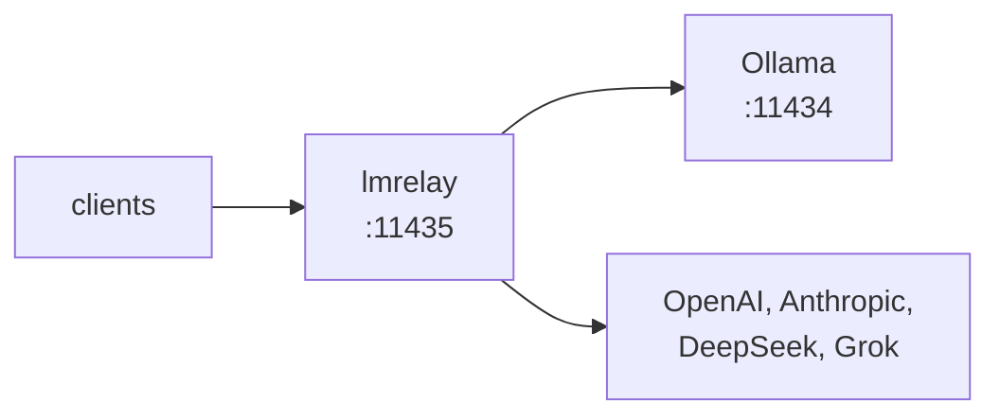

## lmrelay - 本地 Ollama 旁的凭据中继

[](https://github.com/wachawo/lmrelay/blob/main/LICENSE)
[](https://github.com/wachawo/lmrelay)
[](https://github.com/wachawo/lmrelay)
[](https://github.com/wachawo/lmrelay/blob/main/pyproject.toml)

一个小型 HTTP 中继，在本地 [Ollama](https://ollama.com) 旁监听 11435，可要求调用方出示凭据，并通过在路径前加一个路径段来访问托管服务商。

[English](https://github.com/wachawo/lmrelay/blob/main/README.md) | [Español](https://github.com/wachawo/lmrelay/blob/main/docs/README_ES.md) | [Português](https://github.com/wachawo/lmrelay/blob/main/docs/README_PT.md) | [Français](https://github.com/wachawo/lmrelay/blob/main/docs/README_FR.md) | [Deutsch](https://github.com/wachawo/lmrelay/blob/main/docs/README_DE.md) | [Italiano](https://github.com/wachawo/lmrelay/blob/main/docs/README_IT.md) | [Русский](https://github.com/wachawo/lmrelay/blob/main/docs/README_RU.md) | **[中文](https://github.com/wachawo/lmrelay/blob/main/docs/README_ZH.md)** | [日本語](https://github.com/wachawo/lmrelay/blob/main/docs/README_JA.md) | [हिन्दी](https://github.com/wachawo/lmrelay/blob/main/docs/README_HI.md) | [한국어](https://github.com/wachawo/lmrelay/blob/main/docs/README_KR.md)



### 环境要求

- Python 3.11 或更高版本，以及三个依赖：FastAPI、uvicorn 和 httpx。
- Linux 和 macOS 支持全部命令，包括 `serve`（后台运行）和 `enable`：在 Linux 上是 systemd
  `--user` 单元，在 macOS 上是 launchd agent；两者都没装的地方则直接拒绝。
- Windows 只支持 `run`。`serve` 会指出该平台没有 `os.fork`，`enable` 会指出既没有 systemd
  也没有 launchd，而不是启动到一半。
- 11434 上的本地 Ollama 是默认上游，但并非必需。只配置了托管服务商的中继同样可用，前提是
  `default_upstream` 指向其中之一。

### 安装

```bash
pip install git+https://github.com/wachawo/lmrelay.git
```

`git+` 前缀不是装饰：pip 会把裸的 `github.com/...` 当成包名，然后失败。如果机器上没有
git，源码归档同样可用，且不需要 git：

```bash
pip install https://github.com/wachawo/lmrelay/archive/refs/heads/main.tar.gz
```

### 快速开始

```bash
lmrelay init     # writes ~/.lmrelay/lmrelay.toml
lmrelay run      # foreground, port 11435
```

Ollama 保留 11434，它的安装原封不动。改为把客户端指向 11435。这就是这里的取舍：现有的
Ollama 不必做任何改动，中继由各客户端自行决定是否接入。

全新状态下鉴权是关闭的，所以在回环地址上，它就是 Ollama 前面的一个透明代理。这是有意
为之：刚装好的中继不该在你拿到令牌之前，就把你挡在自己的 Ollama 之外。把客户端指向
11435 就能用：

```bash
OLLAMA_HOST=127.0.0.1:11435 ollama list
```

### 验证是否正常

向中继请求模型列表。两种方言都可以，它们都指向同一个 Ollama：

```bash
curl http://127.0.0.1:11435/api/tags     # Ollama's own shape
curl http://127.0.0.1:11435/v1/models    # the OpenAI-compatible shape
```

然后让模型干活。这里的 `qwen3:8b` 就是 `ollama list` 在你机器上列出的名字：

```bash
curl http://127.0.0.1:11435/api/generate \
  -d '{"model": "qwen3:8b", "prompt": "Reply with exactly: it works", "stream": false, "think": false}'
```

```bash
curl http://127.0.0.1:11435/v1/chat/completions \
  -H "Content-Type: application/json" \
  -d '{"model": "qwen3:8b", "messages": [{"role": "user", "content": "say ok"}]}'
```

`qwen3` 会先推理再回答，而只有 Ollama 的方言提供了开关，即上面的 `"think": false`。经由 `/v1/chat/completions` 时，推理会作为 `<think>` 块出现在 content 里，因为 lmrelay 原样转发上游产生的内容，不做修改。

开启鉴权后，上面每一个请求都需要带上凭据：

```bash
curl -H "Authorization: Bearer $LMRELAY_TOKEN" http://127.0.0.1:11435/api/tags
```

### 正式运行

```bash
lmrelay token gen --label laptop   # prints the token once, turns auth on
lmrelay enable                     # start at login, and start now
lmrelay status
```

```
lmrelay      running (pid 40213), healthy
listening    127.0.0.1:11435
config       /home/u/.lmrelay/lmrelay.toml
state        /home/u/.lmrelay/state.json
upstreams    anthropic, ollama, openai (default: ollama)
auth         on, 2 tokens
autostart    systemd: enabled, active
```

`enable` 在 Linux 上注册一个 systemd `--user` 单元，在 macOS 上注册一个 launchd
agent，然后把它启动起来。此后 `stop`、`restart` 和 `reload` 都走该管理器而不是
pidfile，两者因此不会对进程归谁管产生分歧。在两种管理器都没有的 POSIX 机器上，用
`lmrelay serve` 以后台方式运行中继。

### 用法

| 命令 | 作用 |
|---|---|
| `lmrelay init` | 写入 `~/.lmrelay/lmrelay.toml` |
| `lmrelay run` | 在前台运行 |
| `lmrelay serve` | 后台运行，日志追加到 `lmrelay.log` |
| `lmrelay stop` | 停止正在运行的中继 |
| `lmrelay restart` | 先停止，再重新以后台方式启动 |
| `lmrelay reload` | 重新读取配置，不断开任何连接 |
| `lmrelay status` | 正在运行什么、在哪里运行、用了哪些上游 |
| `lmrelay enable` | 登录时启动，并立即启动 |
| `lmrelay disable` | 撤销 `enable` |
| `lmrelay auth true\|false` | 要求调用方出示凭据，或不要求 |
| `lmrelay token gen [--label L]` | 生成一个令牌并打印一次 |
| `lmrelay token add TOKEN [--label L]` | 注册一个你自己选定的令牌 |
| `lmrelay token list [--show]` | 列出令牌，除非加 `--show`，否则打码 |
| `lmrelay token delete ID` | 按 `token list` 打印的 id 删除其中一个 |
| `lmrelay provider add NAME TOKEN` | 添加或轮换一个上游 |
| `lmrelay provider list [--show]` | 全部上游，来自配置文件和 state |
| `lmrelay provider delete NAME` | 删除由 state 拥有的服务商 |

`run`、`serve` 和 `restart` 接受 `--host` 和 `--port`。`provider add` 接受
`--base-url`、`--dialect` 以及可重复的 `--header K=V`；如果名称是已知的那几个——
`openai`、`anthropic`、`deepseek`、`grok`、`ollama`——base URL、方言和请求头形态都来自
预设，所以 `lmrelay provider add openai sk-...` 就是完整的命令。凡是读取配置或 state
的命令都接受 `--config PATH`，也就是除 `init` 和 `disable` 以外的全部命令；`init` 始终写入
`~/.lmrelay/lmrelay.toml`，而 `disable` 两者都不读。

### 选择上游

当且仅当第一个路径段与 `[upstream]` 中的某个键完全一致时，它才用于选择上游。否则由
`default_upstream` 处理该请求，路径原样保留。

```
POST /api/chat                      -> ollama    , forwards /api/chat
POST /v1/chat/completions           -> ollama    , forwards /v1/chat/completions
POST /openai/v1/chat/completions    -> openai    , forwards /v1/chat/completions
POST /anthropic/v1/messages         -> anthropic , forwards /v1/messages
POST /deepseek/v1/chat/completions  -> deepseek  , forwards /v1/chat/completions
POST /grok/v1/chat/completions      -> grok      , forwards /v1/chat/completions
```

因此客户端只需记住一次端口，把某个客户端改指到另一个服务商只是一行的事：

```python
from openai import OpenAI
from anthropic import Anthropic

OpenAI(base_url="http://relay:11435/openai/v1", api_key=RELAY_TOKEN)
OpenAI(base_url="http://relay:11435/v1",        api_key=RELAY_TOKEN)   # local Ollama
Anthropic(base_url="http://relay:11435/anthropic", api_key=RELAY_TOKEN)
```

```bash
curl http://127.0.0.1:11435/api/chat \
  -H "Authorization: Bearer $LMRELAY_TOKEN" \
  -d '{"model": "llama3", "messages": [{"role": "user", "content": "hi"}]}'
```

`GET /healthz` 返回 `{"status": "ok"}`，既不接触上游，也不需要凭据。其余请求一律经由
中继转发。

### 兼容性

lmrelay **原样**转发方法、路径、查询字符串和请求体字节，并且不在 API 方言之间做转换。

| 客户端使用的 API | 它使用的路径 | ollama | openai | deepseek | grok | anthropic |
|---|---|:--:|:--:|:--:|:--:|:--:|
| Ollama API | `/api/chat`、`/api/generate`、`/api/tags` | yes | no | no | no | no |
| OpenAI API | `/v1/chat/completions`、`/v1/models` | yes¹ | yes | yes | yes | no |
| Anthropic API | `/v1/messages` | no | no | no | no | yes |

¹ Ollama 在原生的 `/api/*` 之外，还在 `/v1/*` 上提供一套 OpenAI 兼容接口。这是实际中
最要紧的一格：一个 OpenAI 形态的客户端只要改路径前缀，就能访问 ollama、openai、
deepseek 和 grok **全部**四个上游。

四种行不通的情况，以及每一种为什么无法做通，都在配置文档里。

在 lmrelay 能确定某个路径在上游根本不存在的地方，它会自己讲明，而不是让服务商的 404
看起来像是你的错：

```json
{"error": "lmrelay: upstream 'anthropic' speaks the Anthropic API; '/v1/chat/completions' is an OpenAI-dialect path. lmrelay forwards requests unchanged and does not translate between dialects."}
```

lmrelay 产生的每条错误都以 `lmrelay: ` 开头，所以绝不会被误当成服务商说的话。

**[配置与错误](https://github.com/wachawo/lmrelay/blob/main/docs/CONFIGURATION.md)** - 配置文件、调用方令牌、服务商、开机自启、流式行为，以及每条错误的含义。

### 测试

```sh
pip install -e '.[test]'
pytest
```

测试套件大部分在进程内驱动应用，对接一个记录型上游，因此不需要网络，也不需要 Ollama。
[`tests/test_streaming.py`](../tests/test_streaming.py) 是例外：它把中继跑在 uvicorn
下，前面接一个每次只答一块的上游，因为它要验证的性质——调用方在上游写出最后一行之前
就已拿到第一行——透过进程内客户端是看不见的。

### 许可证

MIT License。见 [LICENSE](../LICENSE)。
